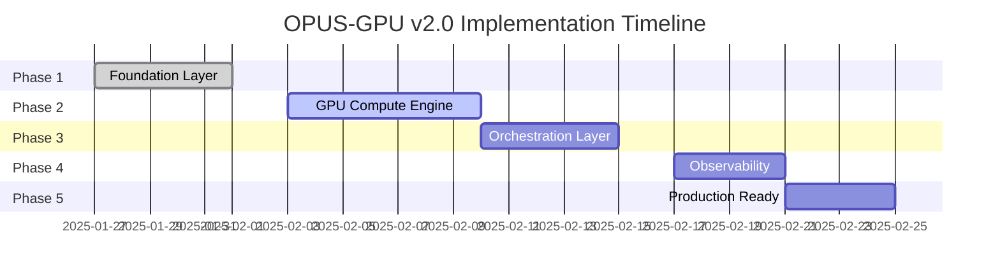

# 📅 IMPLEMENTATION ROADMAP - OPUS-GPU v2.0

## 🎯 Tổng Quan Lộ Trình

**Tổng thời gian**: 25 ngày làm việc (5 tuần)  
**Số phase**: 5 phases  
**Tổng số bước**: 45 bước thực hiện  
**Phương pháp**: **Agile Sprint** (phát triển linh hoạt – chu kỳ ngắn) với **Daily Standup** (họp hàng ngày – cập nhật tiến độ)

---

## 📊 TIMELINE OVERVIEW



---

## 🏃 SPRINT PLANNING

### Sprint 1: Foundation (Tuần 1)
**Duration**: 5 ngày  
**Goal**: Core runtime hoạt động với plugin cơ bản

#### Daily Breakdown

**Day 1 - Monday (27/01)**
```yaml
Morning (4h):
  - Setup Rust workspace structure
  - Initialize Git repository với .gitignore
  - Create Cargo workspace với sub-crates
  - Setup pre-commit hooks (rustfmt, clippy)

Afternoon (4h):  
  - Write initial Cargo.toml dependencies
  - Implement basic project skeleton
  - Setup logging với tracing crate
  - Create initial CI/CD pipeline

Deliverables:
  - Compilable project structure
  - Basic "Hello World" binary
  - GitHub Actions workflow file
```

**Day 2 - Tuesday (28/01)**
```yaml
Morning (4h):
  - Design plugin trait interface
  - Implement core event loop (Tokio)
  - Setup async runtime configuration
  - Create plugin discovery mechanism

Afternoon (4h):
  - Implement plugin lifecycle (init/shutdown)
  - Add error handling framework
  - Write unit tests for core runtime
  - Document plugin API

Deliverables:
  - Working event loop
  - Plugin trait definition
  - 70% test coverage for core
```

**Day 3 - Wednesday (29/01)**
```yaml
Morning (4h):
  - Implement dynamic library loading
  - Add plugin version checking
  - Create plugin registry
  - Setup plugin hot-reload watcher

Afternoon (4h):
  - Build example dummy plugin
  - Test plugin load/unload cycle
  - Add plugin isolation boundaries
  - Performance profiling setup

Deliverables:
  - Plugin manager working
  - Dummy plugin loads successfully
  - Hot-reload demonstrated
```

**Day 4 - Thursday (30/01)**
```yaml
Morning (4h):
  - Design IPC message protocol
  - Setup shared memory segments
  - Implement lock-free queue
  - Create message serialization

Afternoon (4h):
  - Build IPC benchmark suite
  - Optimize message passing
  - Add IPC error recovery
  - Document IPC protocol

Deliverables:
  - IPC throughput > 1GB/s
  - Message protocol defined
  - Benchmark results documented
```

**Day 5 - Friday (31/01)**
```yaml
Morning (4h):
  - Configuration system (YAML/TOML)
  - Environment variable handling
  - Config validation và schema
  - Hot-reload configuration

Afternoon (4h):
  - Integration testing
  - Documentation writing
  - Code review và refactoring
  - Sprint retrospective

Deliverables:
  - Complete foundation layer
  - All tests passing
  - Documentation updated
```

### Sprint 2: GPU Integration (Tuần 2)
**Duration**: 7 ngày  
**Goal**: CUDA integration với high-performance GPU operations

#### Key Milestones

**Days 6-7: CUDA Setup**
- Rust-CUDA bindings integration
- Device enumeration và selection
- Memory management strategies
- **Target**: Execute first CUDA kernel

**Days 8-9: Kernel Development**
- Compute kernel implementation
- PTX compilation pipeline
- Stream management
- **Target**: Multi-stream execution

**Days 10-12: Optimization**
- NVML integration for monitoring
- Performance profiling với Nsight
- Memory optimization techniques
- **Target**: 90% GPU utilization

### Sprint 3: Orchestration (Tuần 3)
**Duration**: 5 ngày  
**Goal**: Complete scheduling và coordination

**Day 13-14: Scheduler Core**
- Go scheduler implementation
- CGO bindings to Rust
- Task model definition

**Day 15-16: Advanced Scheduling**
- Priority queue implementation
- Load balancing algorithms
- Fault tolerance mechanisms

**Day 17: Integration**
- End-to-end testing
- Performance benchmarking
- Bug fixes và optimization

### Sprint 4: Monitoring (Tuần 4)
**Duration**: 4 ngày  
**Goal**: Full observability stack

**Day 18-19: Metrics & Tracing**
- Prometheus metrics setup
- OpenTelemetry integration
- Custom GPU metrics

**Day 20-21: Visualization**
- Grafana dashboards
- Alert rules configuration
- SLI/SLO definitions

### Sprint 5: Production (Tuần 5)
**Duration**: 4 ngày  
**Goal**: Production-ready deployment

**Day 22-23: Security & Optimization**
- Code obfuscation
- Binary optimization
- Security audit

**Day 24-25: Deployment & Testing**
- Docker/Kubernetes setup
- Load testing at scale
- Final documentation

---

## 📋 DETAILED TASK BREAKDOWN

### Phase 1 Tasks (Foundation)

| ID | Task | Priority | Effort | Dependencies | Owner |
|----|------|----------|--------|--------------|-------|
| F01 | Rust workspace setup | P0 | 2h | None | DevOps |
| F02 | Core runtime implementation | P0 | 8h | F01 | Core |
| F03 | Plugin trait design | P0 | 4h | F02 | Core |
| F04 | Plugin manager | P0 | 8h | F03 | Core |
| F05 | IPC protocol design | P0 | 4h | F02 | Core |
| F06 | Shared memory implementation | P0 | 6h | F05 | Core |
| F07 | Configuration system | P1 | 4h | F02 | Core |
| F08 | Logging framework | P1 | 3h | F02 | Core |
| F09 | Error handling | P1 | 3h | F02 | Core |
| F10 | Unit tests | P0 | 8h | All | QA |

### Phase 2 Tasks (GPU Engine)

| ID | Task | Priority | Effort | Dependencies | Owner |
|----|------|----------|--------|--------------|-------|
| G01 | CUDA bindings setup | P0 | 4h | F04 | GPU |
| G02 | Device management | P0 | 4h | G01 | GPU |
| G03 | Memory allocation | P0 | 6h | G01 | GPU |
| G04 | Kernel compilation | P0 | 8h | G01 | GPU |
| G05 | Stream management | P0 | 6h | G03 | GPU |
| G06 | NVML integration | P1 | 4h | G02 | GPU |
| G07 | Task queue implementation | P0 | 8h | G05 | GPU |
| G08 | Performance profiling | P1 | 6h | G04 | GPU |
| G09 | Resource limits | P1 | 4h | G07 | GPU |
| G10 | Optimization passes | P2 | 8h | G08 | GPU |
| G11 | GPU tests | P0 | 8h | All | QA |
| G12 | Benchmarks | P1 | 4h | G11 | QA |

---

## 🎯 DEFINITION OF DONE (DoD)

### Code Quality Criteria
```yaml
code_standards:
  - Passes rustfmt và clippy without warnings
  - No unsafe code without documentation
  - All public APIs have rustdoc comments
  - Error handling với Result<T, E> types

testing:
  - Unit test coverage >= 80%
  - Integration tests pass
  - Performance benchmarks meet targets
  - No memory leaks (valgrind clean)

documentation:
  - README.md updated
  - API docs generated
  - Architecture diagrams current
  - Changelog entry added
```

### Performance Criteria
```yaml
latency:
  p50: "< 5ms"
  p95: "< 10ms"
  p99: "< 20ms"

throughput:
  minimum: "1000 req/s"
  target: "2000 req/s"
  
gpu_metrics:
  utilization: "> 90%"
  memory_efficiency: "> 80%"
  
reliability:
  uptime: "99.95%"
  mttr: "< 15 minutes"
```

---

## 🚧 RISK MANAGEMENT

### Technical Risks

| Risk | Probability | Impact | Mitigation |
|------|------------|--------|------------|
| **CUDA compatibility issues** | Medium | High | Test on multiple GPU models |
| **Performance regression** | Low | High | Continuous benchmarking |
| **Memory leaks in unsafe code** | Medium | High | Valgrind CI checks |
| **Plugin ABI instability** | Medium | Medium | Version pinning |
| **IPC bottleneck** | Low | Medium | Alternative protocols ready |

### Schedule Risks

| Risk | Probability | Impact | Mitigation |
|------|------------|--------|------------|
| **Scope creep** | High | Medium | Strict sprint planning |
| **Technical debt** | Medium | Low | Regular refactoring |
| **Dependency delays** | Low | High | Early integration |
| **Testing bottleneck** | Medium | Medium | Parallel test execution |

---

## 📈 SUCCESS METRICS

### Sprint Velocity
```yaml
sprint_1:
  planned_points: 40
  completed_points: target >= 36
  
sprint_2:
  planned_points: 56
  completed_points: target >= 50
  
sprint_3:
  planned_points: 40
  completed_points: target >= 36
  
sprint_4:
  planned_points: 32
  completed_points: target >= 28
  
sprint_5:
  planned_points: 32
  completed_points: target >= 28
```

### Quality Gates

**Gate 1 (End of Sprint 1)**
- Core runtime functional
- Plugin system working
- IPC benchmark passed

**Gate 2 (End of Sprint 2)**
- CUDA kernels executing
- GPU utilization > 80%
- No memory leaks

**Gate 3 (End of Sprint 3)**
- Scheduler integrated
- Load balancing working
- Fault tolerance tested

**Gate 4 (End of Sprint 4)**
- Monitoring complete
- Dashboards deployed
- Alerts configured

**Gate 5 (End of Sprint 5)**
- Production ready
- Security audit passed
- Documentation complete

---

## 🔄 CONTINUOUS IMPROVEMENT

### Daily Practices
- **Morning Standup** (15 min): Progress, blockers, plans
- **Code Review** (ongoing): All PRs reviewed within 4h
- **Testing** (continuous): Tests run on every commit

### Weekly Practices
- **Sprint Planning** (Monday, 2h)
- **Technical Deep Dive** (Wednesday, 1h)
- **Retrospective** (Friday, 1h)

### Metrics Tracking
```yaml
daily:
  - Lines of code
  - Test coverage
  - Build status
  - Open issues

weekly:
  - Sprint velocity
  - Bug discovery rate
  - Performance trends
  - Technical debt

monthly:
  - Architecture review
  - Security assessment
  - Dependency updates
```

---

## 📞 COMMUNICATION PLAN

### Stakeholder Updates
- **Daily**: Slack status in #opus-gpu-dev
- **Weekly**: Progress report email
- **Sprint End**: Demo session (30 min)

### Documentation
- **Code**: Inline rustdoc comments
- **API**: OpenAPI 3.0 spec
- **Wiki**: Confluence/GitHub Wiki
- **Runbooks**: Markdown in /docs

### Escalation Path
1. **Technical Issues**: Tech Lead → Architect → CTO
2. **Resource Issues**: PM → Engineering Manager
3. **Security Issues**: Security Team (immediate)

---

## ✅ LAUNCH CHECKLIST

### Pre-Launch (Day 24)
- [ ] All tests passing (unit, integration, e2e)
- [ ] Performance benchmarks met
- [ ] Security audit complete
- [ ] Documentation reviewed
- [ ] Monitoring configured
- [ ] Rollback plan documented

### Launch Day (Day 25)
- [ ] Deploy to staging
- [ ] Smoke tests pass
- [ ] Load test successful
- [ ] Deploy to production
- [ ] Monitor metrics
- [ ] Announce launch

### Post-Launch (Day 26+)
- [ ] Monitor for 48h
- [ ] Gather feedback
- [ ] Address issues
- [ ] Plan v2.1 features
- [ ] Retrospective meeting
- [ ] Success celebration 🎉

---

*Roadmap Version: 1.0.0*  
*Last Updated: 2025-01-26*  
*Next Review: End of Sprint 1*
