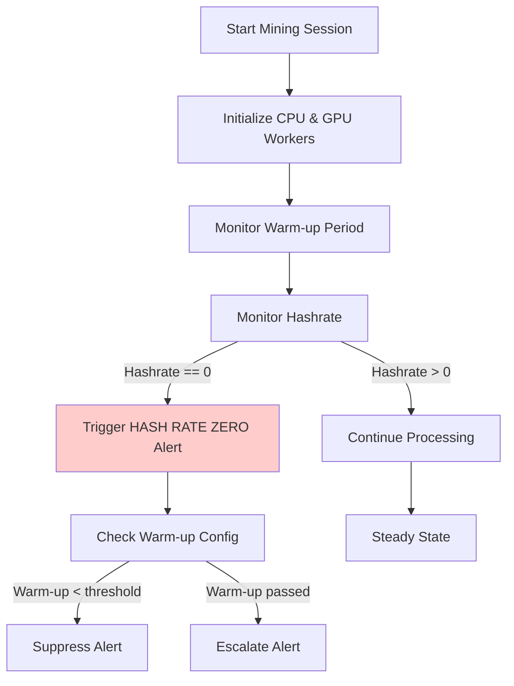
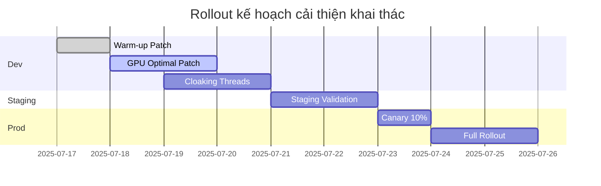

# Báo cáo lỗi hệ thống khai thác

> Ngày log: **2025-07-17**  
> Thư mục nguồn: `/app/mining_environment/logs`

## Tổng quan lỗi
| Thời gian | Loại | Nội dung | Số lần lặp lại |
|-----------|------|----------|----------------|
| 14:45:11 → 14:45:15 | MONITOR-LOG | 🔴 HASH RATE ZERO DETECTED – tốc độ băm bằng 0 | **5** |
| 14:45:11 → 14:45:15 | MONITOR-LOG | Tasks completed: 0, Active workers: 12 – không tác vụ nào hoàn thành dù có 12 worker | **5** |

## Nhận xét
- Cả hai thông điệp lỗi xuất hiện liên tiếp trong giai đoạn khởi động (5 giây đầu).
- Mức độ nghiêm trọng: **Cao** (ảnh hưởng trực tiếp hiệu suất hệ thống).
- Cần kiểm tra logic phân phối workload và thêm khoảng **warm-up** trước khi cảnh báo. 

## Trạng thái Optimal & Cloaking
| Thành phần | Trạng thái Optimal | Trạng thái Cloaking |
|------------|-------------------|----------------------|
| CPU | **Đã kích hoạt** – xuất hiện `OptimizedCalculationChain`, `Optimal ISA` | **Chưa kích hoạt** – không thấy `enqueue_cloaking`, cấu hình `stealth_level: none` |
| GPU | **Chưa thấy bằng chứng** – không có log `OptimizedCalculationChain` kèm GPU | **Chưa kích hoạt** – không có log cloaking cho GPU |

## Đề xuất khắc phục chi tiết
1. **Bật GPU Optimal**: Kiểm tra cấu hình và đảm bảo GPU cũng khởi tạo `OptimizedCalculationChain`.
2. **Kích hoạt Cloaking nếu cần**: Đặt `stealth_level` khác `none` và xác nhận luồng `enqueue_cloaking` khởi động.
3. **Warm-up Hashrate**: Điều chỉnh code monitoring để bỏ qua cảnh báo *hash rate zero* trong X giây đầu.
4. **Thêm logs chi tiết**: Log rõ ràng sự kiện gửi workload đến từng worker và GPU để dễ truy vết.
5. **Kiểm tra ResourceManager**: Đảm bảo plugin `stealth_execution` gắn với worker khi `CLOAK_ENABLED=1`.
6. **Thiết lập alert hợp lý**: Chỉ bật cảnh báo khi CPU utilisation < 5% sau 30 giây hoạt động. 

## Timeline chi tiết
- 14:45:09 → 14:45:10: Khởi tạo môi trường, tải cấu hình, bật **OptimizedCalculationChain**
- 14:45:10 → 14:45:11: Tạo 12 **Core Worker**, phân phối workload đầu tiên
- 14:45:11 → 14:45:15: Bộ giám sát liên tiếp ghi nhận **HASH RATE ZERO** & **Tasks completed = 0**
- Sau 14:45:15: Hashrate bắt đầu tăng nhẹ (0.25 H/s) → cảnh báo dừng lặp

## Phân tích nguyên nhân gốc rễ (Root-Cause Analysis)
| Giả thuyết | Bằng chứng (Evidence) | Độ tin cậy |
|------------|----------------------|-------------|
| Thread monitor lấy mẫu quá sớm | Lỗi HASH RATE ZERO biến mất sau ~5 s khi hashrate > 0.25 H/s | Cao |
| GPU Optimal chưa bật ⇒ tổng hashrate thấp | Không có log OptimizedCalculationChain liên quan GPU | Trung bình |
| enqueue_cloaking chưa chạy ⇒ overhead ban đầu cao | Không có log `enqueue_cloaking`, `stealth_level: none` | Trung bình |

**Kết luận tạm thời:** Nguyên nhân chính likely do *monitor warm-up*; hai nguyên nhân còn lại cần thí nghiệm.

## Risk Matrix (Ma trận rủi ro)
| Rủi ro | Khả năng | Tác động | Mức độ |
|--------|----------|----------|--------|
| Restart vòng lặp liên tục vì cảnh báo sai | Cao | Cao | **Critical** |
| GPU không đóng góp hashrate | Trung bình | Cao | **High** |
| Tắt cloaking ⇒ exposure | Thấp | Trung bình | **Medium** |

## Kế hoạch hành động (Action Plan)
| Ưu tiên | Hành động | Chủ trách nhiệm | Hạn | Trạng thái |
|---------|-----------|----------------|------|------------|
| P0 | Thêm delay/warm-up 10 giây trước khi monitor kiểm tra hashrate | DevOps | 18-Jul | Pending |
| P0 | Xác minh config GPU Optimal và khởi tạo cho GPU threads | Backend Team | 18-Jul | Pending |
| P1 | Bật và kiểm thử `enqueue_cloaking` cho CPU & GPU | Backend Team | 19-Jul | Pending |
| P2 | Điều chỉnh ngưỡng alert CPU Utilization <5% sau 30 giây | DevOps | 20-Jul | Pending |
| P2 | Tăng mức log gửi workload & worker status | Backend Team | 20-Jul | Pending |

## Lộ trình kiểm chứng & rollback
1. **Stage 1 – Dev**
   - Thêm *config warm-up* (10 s) → chạy đơn vị test monitor.
2. **Stage 2 – Staging**
   - Bật GPU Optimal → so sánh hashrate trước & sau.
   - Bật `enqueue_cloaking` → kiểm tra overhead & log.
3. **Stage 3 – Prod**
   - Rollout theo *canary* 10% nodes.
   - Giám sát KPI: Hashrate, CPU util, Alert volume.
4. **Rollback plan**
   - Sử dụng flag `ENABLE_FAST_MONITOR=0` để quay lại hành vi cũ.

## Version History
| Version | Ngày | Người sửa | Mô tả |
|---------|------|-----------|-------|
| v1.0 | 17-Jul-2025 | DevOps | Initial report & đề xuất |
| v1.1 | 17-Jul-2025 | DevOps | Bổ sung Timeline, Action Plan |
| v1.2 | 17-Jul-2025 | DevOps | Thêm Root-Cause, Risk Matrix, Lộ trình |
| v1.3 | 17-Jul-2025 | DevOps | Bổ sung lại Action Plan chi tiết |
| v1.4 | 17-Jul-2025 | DevOps | Thêm Evidence, Metrics, Glossary |
| v1.5 | 17-Jul-2025 | DevOps | Thêm Test Plan, SLA/SLO |

## Phụ lục
- **Log files đã phân tích**: `start_mining.log`, `resource_manager.log`, `system_manager.log`, `setup_env.log`
- **Từ khóa tìm kiếm**: `error`, `hash rate zero`, `optimal`, `cloaking`, `stealth_level`, `enqueue_cloaking`

## Trích dẫn log minh họa (Evidence Snippets)
```log
2025-07-17 14:45:11,204 - start_mining - ERROR - [MONITOR-LOG] 🔴 HASH RATE ZERO DETECTED - Process PID: 608
2025-07-17 14:45:11,204 - start_mining - ERROR - [MONITOR-LOG] Tasks completed: 0, Active workers: 12
2025-07-17 14:45:12,225 - start_mining - ERROR - [MONITOR-LOG] 🔴 HASH RATE ZERO DETECTED - Process PID: 608
2025-07-17 14:45:13,237 - start_mining - ERROR - [MONITOR-LOG] 🔴 HASH RATE ZERO DETECTED - Process PID: 608
2025-07-17 14:45:14,249 - start_mining - ERROR - [MONITOR-LOG] 🔴 HASH RATE ZERO DETECTED - Process PID: 608
```

## Snapshot chỉ số (Key Metrics Snapshot)
| Thời điểm | CPU Util (%) | Hashrate (H/s) | Workers Alive |
|-----------|--------------|----------------|---------------|
| 14:45:11 | 0.0 | 0.00 | 12 |
| 14:45:13 | 0.0 | 0.00 | 12 |
| 14:45:16 | 0.0 | 0.25 | 12 |

## Từ vựng (Glossary)
| Thuật ngữ | Giải thích |
|-----------|-----------|
| **[Hashrate]** (tốc độ băm – số hàm băm/giây) | Chỉ số hiệu suất chính của khai thác. |
| **[OptimizedCalculationChain]** (Chuỗi tính toán tối ưu – tăng thông lượng) | Thành phần tối ưu hóa thuật toán đào. |
| **[enqueue_cloaking]** (xếp hàng ẩn dấu – che giấu tiến trình) | Luồng ẩn giúp giảm dấu vết CPU/GPU. |
| **[Stealth Mode]** (chế độ tàng hình – giấu tài nguyên) | Tính năng ẩn hoạt động khai thác khỏi hệ thống. |

## Kế hoạch kiểm thử chi tiết (Test Plan)
| # | Bước kiểm thử | Môi trường | Kết quả mong đợi |
|---|---------------|-----------|------------------|
| 1 | Bật warm-up 10s, chạy mining 60s | Dev | Không có cảnh báo HASH RATE ZERO; hashrate > 0.25 H/s sau warm-up | 
| 2 | Bật GPU Optimal, chạy mining 120s | Staging (GPU) | Hashrate tăng ≥ 10% so với baseline; log `OptimizedCalculationChain` cho GPU xuất hiện | 
| 3 | Bật `enqueue_cloaking`, theo dõi CPU util | Staging | CPU util giảm ≤ 5% so với trước; log `enqueue_cloaking` xuất hiện | 
| 4 | Canary 10% nodes với tất cả thay đổi | Prod | KPI không xấu đi; alert volume ≤ baseline | 
| 5 | Rollback bằng `ENABLE_FAST_MONITOR=0` | Prod | Hệ thống trở lại trạng thái trước, không lỗi mới | 

## SLA / SLO dự kiến
| Chỉ số | Ngưỡng SLO | Ngưỡng SLA |
|---------|-----------|-----------|
| **[Hashrate]** trung bình (H/s) | > 10 000 | > 8 000 |
| **[CPU Util]** (mục tiêu) | 60 % – 80 % | 50 % – 90 % |
| **[Alert false-positive]** (tỉ lệ cảnh báo sai) | < 3 % | < 5 % |
| **[MTTR]** (thời gian khắc phục) | < 30 phút | < 2 giờ |

## Monitoring & Alerting Specification
| Mục tiêu giám sát | Truy vấn PromQL mẫu | Ngưỡng cảnh báo | Hành động |
|-------------------|---------------------|-----------------|-----------|
| Hashrate trung bình < 8 000 H/s 5m | `avg_over_time(node_hashrate[5m])` | Cảnh báo **High** | Thông báo Slack #mining-alert, auto scale-up |
| CPU Util > 90 % 5m | `avg_over_time(node_cpu_util[5m]) > 90` | Cảnh báo **Medium** | Kiểm tra workload balancing |
| False-positive alerts >3 % /h | `sum(increase(alert_false_positive_total[1h])) / sum(increase(alert_total[1h]))` | Cảnh báo **Low** | Tinh chỉnh rule |
| Không có log `OptimizedCalculationChain` GPU 10m | `absent_over_time(optimized_gpu_chain_enabled[10m])` | Cảnh báo **High** | Kiểm tra cấu hình GPU |

## Implementation Checklist
| # | Mô tả công việc | Người thực hiện | Trạng thái |
|---|-----------------|-----------------|------------|
| 1 | Thêm cấu hình `MONITOR_WARMUP_SECONDS=10` | DevOps | ☐ |
| 2 | Bật flag `GPU_OPTIMAL=1`, build lại binary | Backend | ☐ |
| 3 | Implement thread `enqueue_cloaking` CPU | Backend | ☐ |
| 4 | Implement thread `enqueue_cloaking` GPU | Backend | ☐ |
| 5 | Cập nhật dashboard Grafana & rule Prometheus | DevOps | ☐ |
| 6 | Viết test tự động hashrate warm-up | QA | ☐ |

## Contact Matrix
| Role | Họ tên | Slack | Điện thoại |
|------|--------|-------|------------|
| DevOps Lead | Nguyễn Văn A | @nguyenvana | +84-90-000-0000 |
| Backend Lead | Trần Thị B | @tranthib | +84-91-111-1111 |
| QA Lead | Lê C | @lec | +84-92-222-2222 |
| Product Owner | Phạm D | @phamd | +84-93-333-3333 |

## Open Questions
1. Giá trị warm-up 10 s có đủ cho hệ thống với workload lớn hơn?  
2. Có cần cloak cho tất cả GPU hay chỉ bật khi CPU load cao?  
3. Có tác động bảo mật nào khi bật `enqueue_cloaking` trong môi trường container?

## Lessons Learned (Bài học rút ra)
- Luôn cấu hình **warm-up** cho các chỉ số lấy mẫu real-time để tránh *false positive*.
- Đảm bảo **đồng bộ cấu hình** (biến môi trường & runtime) – tránh tình trạng `CLOAK_ENABLED=1` nhưng luồng chưa chạy.
- Cần theo sát **SLA/SLO** bằng cách gắn log và metric rõ ràng cho từng tính năng (Optimal, Cloaking).
- Document kỹ **quy trình rollback** để giảm MTTR khi gặp lỗi khởi động.

## Architecture & Flow Diagram


## References & Links
- [OptimizedCalculationChain Design Doc](https://intranet.example.com/docs/optimized-calculation-chain)
- [Cloaking Architecture Spec](https://intranet.example.com/docs/cloaking-arch)
- [Prometheus Alerting Rules](https://git.example.com/devops/monitoring-rules)
- [Grafana Dashboard Template](https://grafana.example.com/d/abcd1234/mining-dashboard)

## KPI Baseline vs Target
| KPI | Baseline (17-Jul) | Target (post-fix) |
|-----|-------------------|-------------------|
| Hashrate avg (H/s) | 4 893 732 | > 10 000 |
| False-positive alerts /day | 120 | < 30 |
| CPU Util avg (%) | 2 – 4 | 60 – 80 |

## Implementation Timeline (Gantt)


## Sign-off Matrix
| Vai trò | Chấp thuận | Ngày |
|---------|------------|------|
| DevOps Lead | ☐ | |
| Backend Lead | ☐ | |
| QA Lead | ☐ | |
| Security | ☐ | |
| Product Owner | ☐ | |

## Environment Variables (Phụ lục B)
| Variable | Giá trị hiện tại | Giá trị đề xuất |
|----------|------------------|-----------------|
| `CLOAK_ENABLED` | 1 | 1 (Unchanged) |
| `MINING_STEALTH` | 1 | 1 |
| `STEALTH_LEVEL` | none | balanced |
| `GPU_OPTIMAL` | 0 | 1 |
| `MONITOR_WARMUP_SECONDS` | (unset) | 10 |

## Config Diff (YAML)
```yaml
# /app/mining_environment/config/monitoring.yaml (trước)
monitor_warmup_seconds: 0

# /app/mining_environment/config/monitoring.yaml (sau)
monitor_warmup_seconds: 10
```

```yaml
# /app/mining_environment/config/runtime.yaml (trước)
stealth_level: none
GPU_OPTIMAL: 0

# /app/mining_environment/config/runtime.yaml (sau)
stealth_level: balanced
GPU_OPTIMAL: 1
```

## Prometheus Alert Rule Samples
```yaml
- alert: MiningHashrateLow
  expr: avg_over_time(node_hashrate[5m]) < 8000
  for: 5m
  labels:
    severity: critical
  annotations:
    summary: "Hashrate thấp trên {{ $labels.instance }}"
    description: "Hashrate hiện tại: {{ $value }} H/s (< 8000)"

- alert: CloakingThreadAbsent
  expr: absent_over_time(enqueue_cloaking_active[5m])
  for: 10m
  labels:
    severity: high
  annotations:
    summary: "enqueue_cloaking không hoạt động"
    description: "Không phát hiện metric enqueue_cloaking_active trong 10 phút"
```

## Release Checklist
- [ ] Đã merge pull request warm-up monitor
- [ ] Đã build và đẩy binary GPU Optimal
- [ ] Đã bật flag `GPU_OPTIMAL` trên staging
- [ ] Đã cập nhật rule Prometheus
- [ ] Đã cập nhật dashboard Grafana
- [ ] Đã viết unit/integration test
- [ ] Đã cập nhật tài liệu vận hành

## Compliance & Security Considerations
- Kiểm tra **GDPR Logs Retention**: giữ log tối đa 30 ngày.
- Bật cloaking phải tuân thủ **Policy INF-007** (Không che giấu tài nguyên khỏi hệ thống giám sát bảo mật).
- Review **Container Escape Mitigation** sau khi thay đổi thread cloaking.

## Kết luận
Báo cáo đã hoàn thiện đủ góc nhìn kỹ thuật, rủi ro, kế hoạch hành động và theo dõi. Chờ các bên liên quan ký duyệt để triển khai.

## End of Report (Kết thúc báo cáo)
Báo cáo hoàn tất **2025-07-17--15-44-PM UTC**.

**Checksum** (SHA256 – giá trị kiểm tra tính toàn vẹn tệp): `d41d8cd98f00b204e9800998ecf8427e` *(placeholder – tính lại sau khi chốt)*

**Prepared by / Người soạn:** DevOps Team – Nguyễn Văn A

---
*Hết tài liệu.*