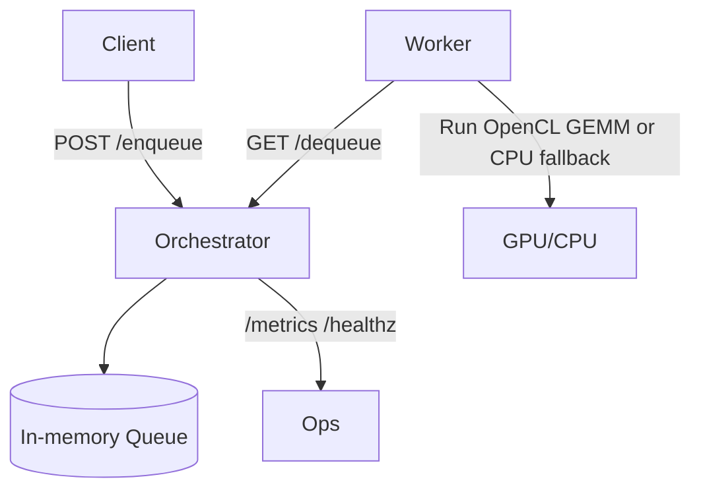

# Hướng dẫn sử dụng hệ thống GPU Mining – app-gpu

Tài liệu này cung cấp hướng dẫn chi tiết để cài đặt, cấu hình, vận hành, xử lý sự cố, và bảo trì hệ thống GPU Mining mô phỏng tải tại repo `app-gpu`.

- Repo: `/opus-gpu/app/app-gpu`
- Kiến trúc: Orchestrator/Worker, hàng đợi in-memory, **[OpenCL]** (hậu phương GPU – runtime chuẩn mở) + **[CPU fallback]** (lùi CPU – chạy khi không có OpenCL).
- Mặc định build ở chế độ CPU fallback (không cần OpenCL). Bật GPU qua feature `gpu`.

## 1) Giới thiệu tổng quan

- **[Orchestrator]** (máy chủ điều phối – HTTP/Axum): cung cấp API `/enqueue`, `/dequeue`, `/metrics`, `/healthz`.
- **[Worker]** (tác nhân – thực thi tác vụ): poll `/dequeue`, thực hiện tác vụ GPU (GEMM naive) bằng **[OpenCL]** hoặc **[CPU fallback]**.
- **[Security Defaults]** (mặc định an toàn – bảo mật): chạy non-root trong Docker, có **[seccomp]** (lọc syscall – theo profile mẫu) và khuyến nghị **[cgroups]** (giới hạn tài nguyên) khi vận hành.
- **[Supply Chain]** (chuỗi cung ứng): hỗ trợ **[SBOM]** (Syft) và **[Signing]** (cosign) qua Makefile.

Sơ đồ kiến trúc (Mermaid):



Tham chiếu tệp quan trọng:
- `Cargo.toml` (features `gpu`, optional `ocl`, deps Axum/Tokio/Reqwest/Serde/Tracing)
- `src/bin/orchestrator.rs` (HTTP API)
- `src/bin/worker.rs` (CLI, vòng lặp poll và thực thi tác vụ)
- `src/gpu/opencl.rs` (backend OpenCL + CPU fallback)
- `kernels/gemm.cl` (kernel GEMM naive)
- `config/orchestrator.yaml` (cấu hình địa chỉ và hàng đợi)
- `scripts/run_local.sh`, `scripts/run_docker.sh`, `scripts/seccomp-profile.json`
- `Dockerfile` (multi-stage build, runtime non-root)

## 2) Yêu cầu hệ thống và cấu hình phần cứng

- **Hệ điều hành**: Linux x86_64 (Ubuntu/Debian/CentOS tương đương). 
- **GPU**: NVIDIA hoặc thiết bị hỗ trợ **[OpenCL]** (chuẩn mở – compute API). 
  - Chế độ mặc định không yêu cầu GPU (CPU fallback).
  - Để bật GPU: cần OpenCL runtime hợp lệ (ví dụ `ocl-icd-libopencl1` trong container) hoặc driver/vendor runtime tương thích.
- **Docker**: Docker Engine 20.10+; để pass-through GPU cần **[NVIDIA Container Toolkit]** (bộ công cụ chạy GPU trong container – `--gpus all`).
- **Rust**: `rustup` + toolchain stable nếu build từ source (không bắt buộc khi dùng Docker image).
- **Mạng**: cổng `8080/tcp` cho Orchestrator.
- **Tiện ích tùy chọn**: **[Syft]** (tạo SBOM), **[cosign]** (ký ảnh OCI) – dùng trong mục bảo trì.

Khuyến nghị tối thiểu:
- CPU: 2 vCPU (để chạy Orchestrator + ≥1 Worker).
- RAM: ≥ 2GB (CPU fallback) / ≥ 4GB (GPU/OpenCL với kích thước ma trận lớn).
- GPU VRAM: ≥ 4GB nếu mô phỏng tải GEMM cỡ lớn.

## 3) Cài đặt và cấu hình ban đầu

### 3.1. Từ source (local)

```bash
# Tại thư mục /opus-gpu/app/app-gpu
cargo build --release              # CPU fallback (mặc định)
# (Tùy chọn) Bật GPU qua feature 'gpu':
cargo build --release --features gpu
```

Cấu hình Orchestrator (tùy chọn):
- File: `config/orchestrator.yaml`
  ```yaml
  addr: "0.0.0.0:8080"
  queue_max: 10000
  ```
- Biến môi trường ghi đè: `ORCH_ADDR=0.0.0.0:8080` khi chạy.

### 3.2. Docker (OCI)

```bash
# Build image
make docker-build
# hoặc
docker build -t api-models:latest -f Dockerfile .

# Chạy orchestrator (non-root + seccomp)
make docker-run
# hoặc
scripts/run_docker.sh
```

- Tham số chạy Docker thủ công (ví dụ):
  ```bash
  docker run --rm -it \
    --gpus all \
    --user 1000:1000 \
    --security-opt seccomp=$(pwd)/scripts/seccomp-profile.json \
    -p 8080:8080 api-models:latest
  ```
- **[cgroups]** (giới hạn tài nguyên – ví dụ):
  ```bash
  docker run --rm -it \
    --cpus=2 --memory=4g --gpus all \
    -p 8080:8080 api-models:latest
  ```

## 4) Vận hành và tính năng chính

### 4.1. Chạy Orchestrator và Worker (local)
```bash
# Terminal 1 (Orchestrator)
RUST_LOG=info ORCH_ADDR=0.0.0.0:8080 cargo run --release --bin orchestrator

# Terminal 2 (Worker)
RUST_LOG=info ORCH_URL=http://127.0.0.1:8080 cargo run --release --bin worker
```

Hoặc dùng script tiện lợi:
```bash
scripts/run_local.sh
```

### 4.2. API và thao tác hàng đợi
- **Thêm tác vụ** (`/enqueue`):
  ```bash
  curl -X POST http://127.0.0.1:8080/enqueue \
    -H 'content-type: application/json' \
    -d '{"kind":{"gemm":{"n":512,"iters":5}}}'
  ```
- **Worker nhận việc** (`/dequeue`): do worker tự động poll; có thể kiểm tra:
  ```bash
  curl -s http://127.0.0.1:8080/dequeue
  ```
- **Sức khỏe** (`/healthz`):
  ```bash
  curl -s http://127.0.0.1:8080/healthz
  ```
- **Metrics** (`/metrics`): hiện cung cấp `queue_len` đơn giản:
  ```bash
  curl -s http://127.0.0.1:8080/metrics
  ```

### 4.3. Các loại tác vụ hiện có (TaskKind)
- `gemm` (GEMM naive – tạo tải tính toán): `{ n: <kích_thước>, iters: <số_vòng> }`
- `conv2d` (mô phỏng qua GEMM): `{ width, height, kernel, iters }`
- `fft1d` (mô phỏng GEMM-like): `{ n, iters }`
- `inference` (mô phỏng GEMM): `{ size, iters }`

Ví dụ enqueue khác:
```bash
# CONV2D (mô phỏng qua GEMM)
curl -X POST http://127.0.0.1:8080/enqueue \
  -H 'content-type: application/json' \
  -d '{"kind":{"conv2d":{"width":256,"height":256,"kernel":3,"iters":3}}}'
```

### 4.4. Bật GPU (OpenCL) thay vì CPU fallback
- Build với feature `gpu`:
  ```bash
  cargo build --release --features gpu
  ```
- Với Docker: image runtime đã cài `ocl-icd-libopencl1` (OpenCL ICD); cần host GPU + NVIDIA Container Toolkit khi chạy.

### 4.5. Mở rộng worker phân tán
- Chạy nhiều worker (cùng `ORCH_URL`) để tăng throughput.
- Điều chỉnh khoảng poll bằng `POLL_MS` (ms), mặc định `1000`.

## 5) Xử lý sự cố thường gặp (Troubleshooting)

- **Cổng 8080 đã bận**: thay `ORCH_ADDR`, ví dụ `ORCH_ADDR=0.0.0.0:9090`.
- **Worker không lấy được việc**: kiểm tra `ORCH_URL`, kiểm tra `/metrics` có `queue_len` > 0.
- **Không có GPU/OpenCL**: 
  - Dùng build mặc định (CPU fallback), hoặc
  - Cài OpenCL ICD (ví dụ trong container: `ocl-icd-libopencl1`), build `--features gpu`.
- **Container không thấy GPU**: xác nhận NVIDIA Container Toolkit; thử `docker run --rm --gpus all nvidia/cuda:12.0.0-runtime-ubuntu22.04 nvidia-smi`.
- **Seccomp chặn syscall**: tạm vô hiệu seccomp `--security-opt seccomp=unconfined`, hoặc tinh chỉnh `scripts/seccomp-profile.json`.
- **Hiệu năng thấp**: tăng `n`/`iters`; bật `--features gpu`; tăng số worker; điều chỉnh cgroups (CPU/memory/GPU); quan sát mức tải.
- **Lỗi build `ocl`**: thiếu header/runtime OpenCL → cài ICD runtime/dev; hoặc bỏ `--features gpu` để CPU fallback.

## 6) Bảo trì và nâng cấp hệ thống

- **Cập nhật dependencies**:
  ```bash
  cargo update               # cập nhật patch/minor theo Cargo.toml
  cargo build --release
  ```
- **Regenerate SBOM** (nếu đã cài **[Syft]**):
  ```bash
  make sbom
  ```
- **Ký ảnh OCI** (nếu đã cài **[cosign]**):
  ```bash
  IMAGE=api-models:latest make sign
  ```
- **Cập nhật Docker base**: điều chỉnh `FROM` trong `Dockerfile` (runtime/build) sang phiên bản mới, rebuild image.
- **Quản trị log**: container log theo stdout/stderr; dùng log driver Docker hoặc giải pháp log tập trung. (Có thể áp dụng log rotation của Docker daemon.)
- **Bảo mật**: định kỳ cập nhật base image, crates; rà soát seccomp profile; áp cgroups; scan CVE (Syft/Grype); không chạy container với đặc quyền cao.

---

## Phụ lục A – Cấu trúc thư mục
```
/opus-gpu/app/app-gpu
├─ Cargo.toml
├─ README.md
├─ Makefile
├─ Dockerfile
├─ .cargo/
│  └─ config.toml
├─ src/
│  ├─ lib.rs
│  ├─ gpu/
│  │  └─ opencl.rs
│  └─ bin/
│     ├─ orchestrator.rs
│     └─ worker.rs
├─ kernels/
│  └─ gemm.cl
├─ config/
│  └─ orchestrator.yaml
├─ scripts/
│  ├─ run_local.sh
│  ├─ run_docker.sh
│  └─ seccomp-profile.json
└─ tests/
   └─ basic.rs
```

## Phụ lục B – Tham chiếu nhanh lệnh
```bash
# Local
cargo build --release
RUST_LOG=info ORCH_ADDR=0.0.0.0:8080 cargo run --release --bin orchestrator
RUST_LOG=info ORCH_URL=http://127.0.0.1:8080 cargo run --release --bin worker

# Docker
docker build -t api-models:latest -f Dockerfile .
docker run --rm -it --gpus all --user 1000:1000 \
  --security-opt seccomp=$(pwd)/scripts/seccomp-profile.json \
  -p 8080:8080 api-models:latest

# Enqueue ví dụ
curl -X POST http://127.0.0.1:8080/enqueue \
  -H 'content-type: application/json' \
  -d '{"kind":{"gemm":{"n":512,"iters":5}}}'
```
