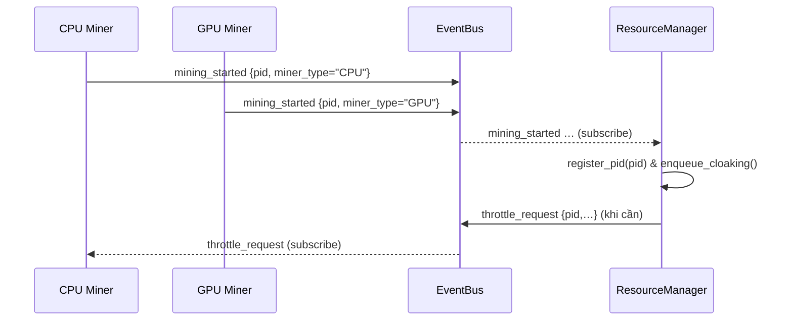
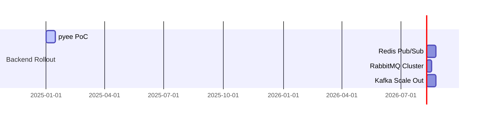

# Tích Hợp EventBus Cho Hệ Thống Mining

## 1️⃣ Mục tiêu tích hợp EventBus
Giúp **ResourceManager** phát hiện và quản lý tiến trình mining **không phụ thuộc** vào tên tiến trình.

Mục tiêu chi tiết:
1. **Real-time discovery** (phát hiện thời gian thực).
2. **Loose Coupling** (tách rời lỏng lẻo).
3. **Observability** (khả năng quan sát qua sự kiện).
4. **Scalability** (mở rộng dễ dàng khi thêm miner mới).

## 2️⃣ Giải pháp tổng thể
### 2.1 Luồng hoạt động


### 2.2 Vai trò & kênh sự kiện
| Thành phần | Publish | Subscribe |
|------------|---------|-----------|
| CPU Core Worker | mining_started, mining_error, hashrate_update | throttle_request, stop_request |
| GPU Miner | mining_started, gpu_temp_update, mining_error | throttle_request, stop_request |
| ResourceManager | throttle_request, restore_request | mining_* |

*Channel đề xuất*: `cpu_mining`, `gpu_mining`, `control` (sử dụng **topic-based routing**).

### 2.3 Công nghệ gợi ý
* **pyee** – PoC in-process.
* **Redis Pub/Sub** – prod đơn máy.
* **RabbitMQ** / **Kafka** – đa máy, thông lượng lớn.

## 3️⃣ Các phase triển khai
| Phase | Công việc | Kết quả |
|-------|-----------|---------|
| **1 – Foundation** | Tích hợp thư viện EventBus (`event_bus.py`), định nghĩa schema JSON. | EventBus hoạt động. |
| **2 – Miner Integration** | CPU/GPU miner publish `mining_started` & `mining_error`. | Miner phát sự kiện. |
| **3 – ResourceManager Hook** | Subscriber nhận `mining_started` ➜ `register_pid`. Giảm polling. | RM nhận PID chính xác. |
| **4 – Control & Monitoring** | RM phát `throttle_request`; miner lắng nghe. Dashboard stream events. | Vòng điều khiển hoàn chỉnh. |
| **5 – Test & Rollout** | Unit/integration test ➜ canary rollout. | Hệ thống ổn định. |

## 4️⃣ Lợi ích & rủi ro
### 4.1 Ưu điểm
* Không phụ thuộc tên tiến trình.
* Phản ứng nhanh.
* Kiến trúc mở rộng & dễ bảo trì.

### 4.2 Rủi ro & Giảm thiểu
| Rủi ro | Mitigation |
|--------|------------|
| Message loss | Redis Stream/Rabbit durable queue + ACK |
| Late subscriber | Retention window 5 s hoặc miner replay định kỳ |
| Complexity | Bắt đầu với pyee ➜ nâng cấp Redis khi ổn |
| SPOF (Redis) | Redis cluster + health-check fallback direct call |

## 5️⃣ Thay đổi logic sau khi áp dụng EventBus
* **discover_mining_processes**: giảm hoặc bỏ polling; giữ fallback mỗi 10 s.
* **enqueue_cloaking** & **CloakStrategy**: giữ nguyên.
* **Bổ sung** sự kiện phản hồi (`cloaking_applied`, `cloaking_health`) để tăng observability.

## 6️⃣ Định hướng điều chỉnh logic PID dựa trên `start_mining.start_mining_process`

### 6.1 Single Source of Truth
* **start_mining_process()** là nơi DUY NHẤT sinh ra PID thực của miner.
* Hàm này phải **publish** sự kiện `mining_started` (và `mining_error`, `mining_stopped`) ngay sau khi `subprocess.Popen` thành công/thất bại.

### 6.2 PID Propagation Flow
1. `start_mining_process` ➜ `event_bus.publish("mining_started", { pid, miner_type, ts })`  
2. `ResourceManager` **subscribe** ➜ `register_pid()` ➜ `enqueue_cloaking()`  
3. `initialize_optimized_mining` **subscribe** ➜ nhận PID CPU để gắn vào chuỗi tối ưu.  
4. Mọi module tương lai chỉ cần subscribe, loại bỏ quét tên process.

### 6.3 Điều chỉnh mã nguồn đề xuất
| File | Mô tả thay đổi |
|------|----------------|
| `event_bus.py` | Thêm hàm `publish/subscribe` (pyee/redis). |
| `start_mining.py » start_mining_process` | Gọi `publish("mining_started", {...})` ngay sau khi Popen thành công. |
| `resource_manager.py` | Thêm `subscribe` trong `__init__`, handler `_on_mining_started` gọi `register_pid`. Giảm polling. |
| `start_mining.py » initialize_optimized_mining` | Subscribe để lấy PID CPU, dùng cho OptimizedCalculationChain. |

### 6.4 Chính sách fallback
* Giữ `discover_mining_processes` chạy **mỗi 60 s**.  
* Chỉ kích hoạt nếu **chưa nhận** PID qua EventBus trong 30 s đầu (đề phòng EventBus downtime).

### 6.5 Roadmap cập nhật
Phase 1-2 (Foundation & Publish) không đổi.  
Phase 3 bổ sung bước **unsubscribe/cleanup** khi miner dừng (`mining_stopped`).

---


# 📈 Lộ Trình Triển Khai EventBus Cho Hệ Thống Mining

> Tài liệu này trình bày **lộ trình (roadmap)** chuyển đổi backend EventBus theo các giai đoạn (phase) phát triển của hệ thống Mining. Lộ trình tuân thủ phương châm **Think Big, Do Baby Steps** và giữ nguyên API `event_bus.publish/subscribe` để quá trình _hot-swap_ backend không làm ảnh hưởng code nghiệp vụ.

---

## 0️⃣ Tiền đề & Giả định
- Mọi payload tuân thủ **JSON Schema v1**.  
- Mã nguồn đã tách _adapter layer_ (`event_bus.py`) với 2 hàm:
  ```python
  def publish(event: str, payload: dict) -> None: ...
  def subscribe(event: str, handler: Callable[[dict], None]) -> None: ...
  ```
- Cờ môi trường `EVENT_BUS_BACKEND` quyết định driver: `pyee | redis | rabbitmq | kafka`.

---

## 1️⃣ Lộ trình backend theo giai đoạn

| Phase | Backend | Khung thời gian (ước tính) | Mục tiêu chính | Công việc trọng tâm | Tiêu chí “Done” (CoD) |
|-------|---------|---------------------------|----------------|----------------------|----------------------|
| **1–2** | **pyee** – [EventEmitter] (thư viện phát-nhận sự kiện nội bộ) | Tuần 1-2 | • PoC logic publish/subscribe  
• Kiểm chứng schema & tracing | • Cài đặt `pyee` trong `requirements.txt`  
• Viết unit-test coverage ≥80 %  
• Log latency local | • Test pass, EventBus loop-back <1 µs  
• Trace‐ID xuất hiện ở cả miner & RM |

| **2–4** | **Redis Pub/Sub** (đơn máy) | Tuần 2-4 | • Cho phép miner & RM ở **khác tiến trình**  
• Giảm polling 80 % | • Deploy Redis (`systemd`)  
• Channel schema `channel:<miner_type>`  
• Retry 3 lần khi publish lỗi | • Miner publish thành công 99 %  
• RM nhận PID ≤1 s |
| **4–5** | **RabbitMQ** (HA, [at-least-once] đảm bảo ≥1) | Tuần 4-5 | • Đảm bảo _message durability_  
• Chuẩn bị scale đa máy | • Cluster 2 node + policy `ha-mode=all`  
• Tạo _topic exchange_ `mining`  
• Bật consumer ACK | • Không mất message trong chaos-test  
• Dashboard hiển thị thông lượng |
| **5–6** | **Kafka Cluster** (log-based, throughput cao) | Tuần 5-6+ | • Hỗ trợ >10 k miner  
• Streaming dữ liệu GPU temp | • Topic `mining_started`, … partition theo `miner_id`  
• Setup Prometheus + Kafka Exporter | • Latency p95 <50 ms  
• Message loss <0.1 % sau 48 h |

---

## 2️⃣ Dòng thời gian tham khảo


---

## 3️⃣ Kiểm soát rủi ro & Fallback
1. **Message loss** – dùng Redis Stream hoặc RabbitMQ _persistent_ & ACK.  
2. **Late subscriber** – Kafka consumer group giữ offset; Redis fallback `discover_mining_processes` mỗi 60 s.  
3. **SPOF** (Redis) – triển khai Sentinel/Cluster; RabbitMQ policy HA; Kafka 3 broker + Zookeeper.

---

## 4️⃣ Checklist trước mỗi lần nâng cấp backend
- [ ] Đảm bảo **adapter layer** không đổi API.  
- [ ] Chaos-test: tắt broker 30 s → hệ thống tự phục hồi.  
- [ ] Prometheus alert `eventbus_dropped_total` == 0.  
- [ ] Cập nhật tài liệu _runbook rollback_.

---

## 5️⃣ Tài liệu tham khảo
- `docs/eventbus_integration.md` – Đặc tả tổng thể.  
- Redis Pub/Sub vs Stream: <https://redis.io/docs/>.  
- RabbitMQ Patterns: <https://www.rabbitmq.com/tutorials/>.  
- Kafka Design: <https://kafka.apache.org/documentation/>. 


## 📖 Tóm tắt nội dung phần "Lộ Trình Triển Khai EventBus"
Tài liệu mô tả một roadmap gồm nhiều **\[Phase]** (giai đoạn) nhằm “hot-swap” backend **\[EventBus]** (hệ thống truyền sự kiện – cho phép giao tiếp bất đồng bộ) từ nhỏ tới lớn, bảo đảm nguyên API `publish/subscribe`.  
Trình tự backend: **\[pyee]** (thư viện **\[EventEmitter]** nội bộ) ➜ **\[Redis Pub/Sub]** ➜ **\[RabbitMQ]** (**HA – High Availability**) ➜ **\[Kafka]** (throughput cao).  
Mỗi phase kèm khung thời gian, mục tiêu, công việc trọng tâm, tiêu chí “Done”.

---

## 1️⃣ Các bước triển khai
1. Bước 0 – Tiền đề & Giả định  
2. Bước 1 – Phase 1-2: pyee **EventEmitter** (PoC in-process)  
3. Bước 2 – Phase 2-4: Redis Pub/Sub (đơn máy)  
4. Bước 3 – Phase 4-5: RabbitMQ Cluster (at-least-once, HA)  
5. Bước 4 – Phase 5-6: Kafka Cluster (log-based, throughput cao)  

---

## 2️⃣ Phân tích chi tiết từng bước
### Bước 0 – Tiền đề & Giả định
- **Mục tiêu**: Xác lập chuẩn dữ liệu (JSON Schema v1) & adapter `event_bus.py`.
- **Thành phần**: Tất cả module gọi chung API `publish/subscribe`.
- **Yêu cầu kỹ thuật**: Biến môi trường `EVENT_BUS_BACKEND` chọn driver.
- **Kết quả kỳ vọng**: Mọi code nghiệp vụ độc lập backend, dễ “hot-swap”.

### Bước 1 – pyee EventEmitter (Phase 1-2)
- **Mục tiêu**: Chứng minh khái niệm (PoC) & tracing nội bộ.
- **Tham gia**: CPU/GPU miner (**\[Publisher]** – thành phần phát sự kiện), **\[ResourceManager]** (**\[Subscriber]** – lắng nghe), pyee loop.
- **Yêu cầu kỹ thuật**: Cài **pyee**, unit-test ≥ 80 %, log latency < 1 µs.
- **Kết quả**: Sự kiện loop-back chính xác, trace-ID xuyên qua miner ↔ RM.

### Bước 2 – Redis Pub/Sub (Phase 2-4)
- **Mục tiêu**: Li tách tiến trình miner & RM, giảm polling 80 %.
- **Thành phần**: Redis broker, channel `channel:<miner_type>`.
- **Yêu cầu kỹ thuật**: Deploy Redis bằng **\[systemd]**, retry 3 khi publish lỗi.
- **Kết quả**: Miner publish thành công 99 %, RM nhận PID ≤ 1 s.

### Bước 3 – RabbitMQ Cluster (Phase 4-5)
- **Mục tiêu**: Bảo đảm **\[Message Durability]** (tính bền vững thông điệp), chuẩn bị scale đa máy.
- **Thành phần**: RabbitMQ 2 node, topic exchange `mining`.
- **Yêu cầu kỹ thuật**: Policy `ha-mode=all`, bật consumer ACK.
- **Kết quả**: Chaos-test không mất message, dashboard hiển thị thông lượng.

### Bước 4 – Kafka Cluster (Phase 5-6)
- **Mục tiêu**: Hỗ trợ > 10 000 miner, streaming dữ liệu GPU temp.
- **Thành phần**: Kafka ≥ 3 broker, topic `mining_started` partition theo `miner_id`.
- **Yêu cầu kỹ thuật**: Tích hợp **\[Prometheus]** + Kafka Exporter, latency p95 < 50 ms.
- **Kết quả**: Message loss < 0,1 % sau 48 h, scale out ổn định.

---

## 3️⃣ Đánh giá tổng thể lộ trình
### Ưu điểm
- Tuân thủ “Think Big, Do Baby Steps” → rủi ro thấp khi nâng cấp.
- Giữ nguyên API => code nghiệp vụ không phải sửa.
- Có tiêu chí “Done” rõ và checklist fallback/chaos-test.

### Rủi ro tiềm ẩn
| Rủi ro | Nhận xét |
|--------|---------|
| Chuyển phase nhanh (2 tuần) | Đòi hỏi đội ngũ sẵn sàng, có hạ tầng监控 (**\[Monitoring]**) mạnh. |
| SPOF Redis | Được nhắc mitigation Sentinel/Cluster nhưng cần kế hoạch DR cụ thể. |
| Phức tạp vận hành RabbitMQ ➜ Kafka | Yêu cầu kỹ sư DevOps kinh nghiệm; cần đào tạo & tài liệu runbook chi tiết. |
| Late subscriber dữ liệu history | Redis Pub/Sub không giữ offset; nên cân nhắc Redis Stream ngay từ đầu nếu backlog quan trọng. |

### Gợi ý cải tiến
1. Bổ sung **\[Load Test]** định lượng thông lượng trước khi quyết định mốc chuyển RabbitMQ ➜ Kafka.  
2. Giai đoạn Redis nên triển khai Redis Stream (tùy chọn persistent) để tránh refactor lớn khi qua RabbitMQ.  
3. Checklist “Done” nên thêm tiêu chí **\[Observability]**: metric `eventbus_delay_seconds`, log phân tách theo Trace-ID.  
4. Xây dựng **\[Integration Test]** tự động cho từng phase, mock broker khi cần.

---

## 4️⃣ Giải thích thuật ngữ tiếng Anh
**\[EventBus]** (hệ thống truyền sự kiện – cho phép giao tiếp giữa các tiến trình thông qua sự kiện bất đồng bộ)  
**\[Publisher]** (thành phần phát sự kiện – gửi sự kiện đến EventBus)  
**\[Subscriber]** (thành phần đăng ký – lắng nghe và xử lý sự kiện từ EventBus)  
**\[Phase]** (giai đoạn – mốc triển khai trong lộ trình)  
**\[Backend]** (hệ thống hậu thuẫn – công nghệ chạy phía sau)  
**\[EventEmitter]** (bộ phát sự kiện nội bộ – mô hình Observer)  
**\[Redis Pub/Sub]** (cơ chế publish/subscribe của Redis – truyền thông điệp trong bộ nhớ)  
**\[RabbitMQ]** (hàng đợi thông điệp – hỗ trợ queue/topic, bảo đảm at-least-once)  
**\[Kafka]** (hệ thống log phân tán – throughput cao, lưu offset consumer)  
**\[HA]** (High Availability – tính sẵn sàng cao)  
**\[Message Durability]** (đảm bảo thông điệp được lưu bền vững)  
**\[Prometheus]** (hệ thống giám sát – thu thập & cảnh báo metric)  
**\[Load Test]** (kiểm thử tải – đo khả năng chịu tải của hệ thống)  
**\[Observability]** (khả năng quan sát – gồm logging, metrics, tracing)  
**\[Monitoring]** (giám sát – hoạt động thu thập & cảnh báo sức khỏe hệ thống)


  | Phase | Backend       | Thời gian | Mục tiêu          | Độ phức tạp |
  |-------|---------------|-----------|-------------------|-------------|
  | 1-2   | pyee          | 1-2 tuần  | PoC in-process    | Thấp        |
  | 2-4   | Redis Pub/Sub | 2-4 tuần  | Đa tiến trình     | Trung bình  |
  | 4-5   | RabbitMQ      | 4-5 tuần  | HA + durability   | Cao         |
  | 5-6   | Kafka         | 5-6+ tuần | Scale >10k miners | Rất cao     |